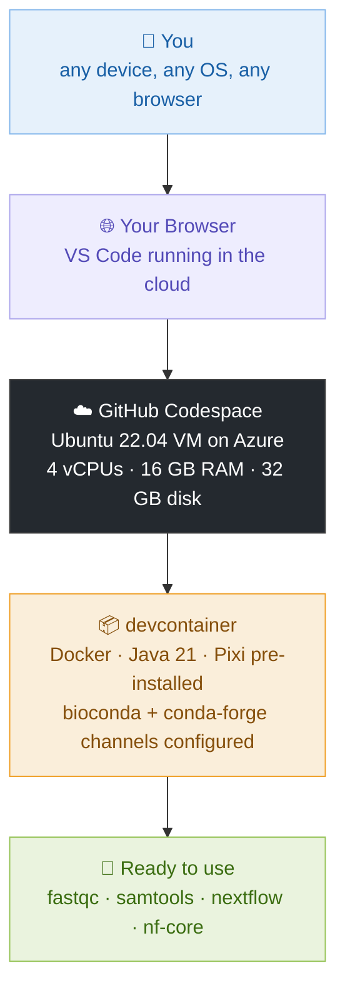
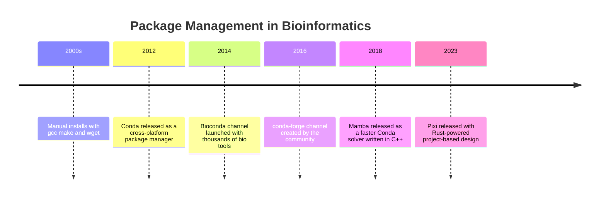
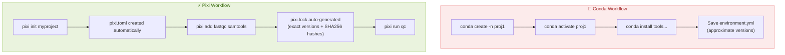
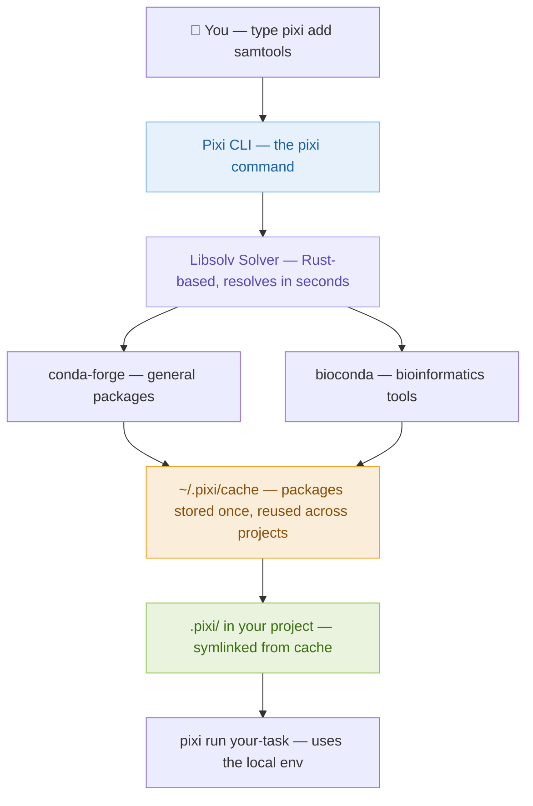
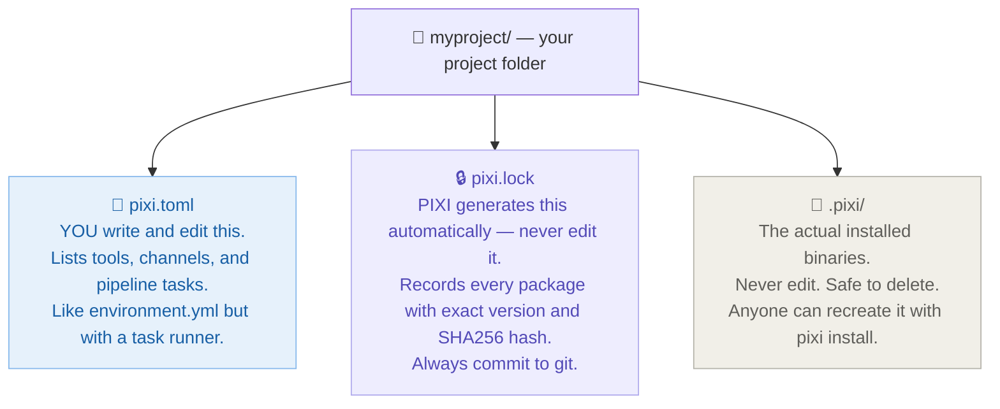
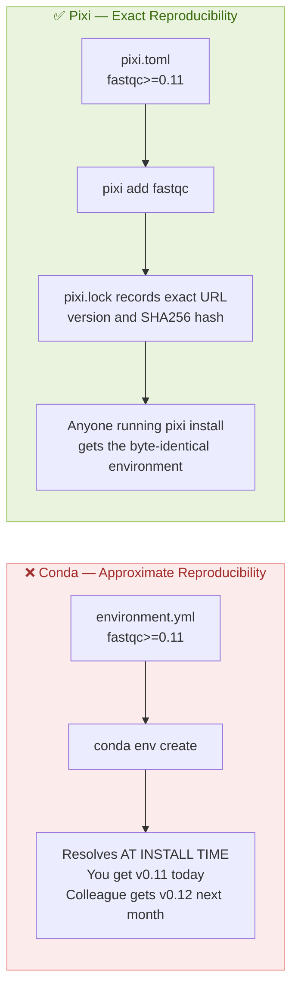
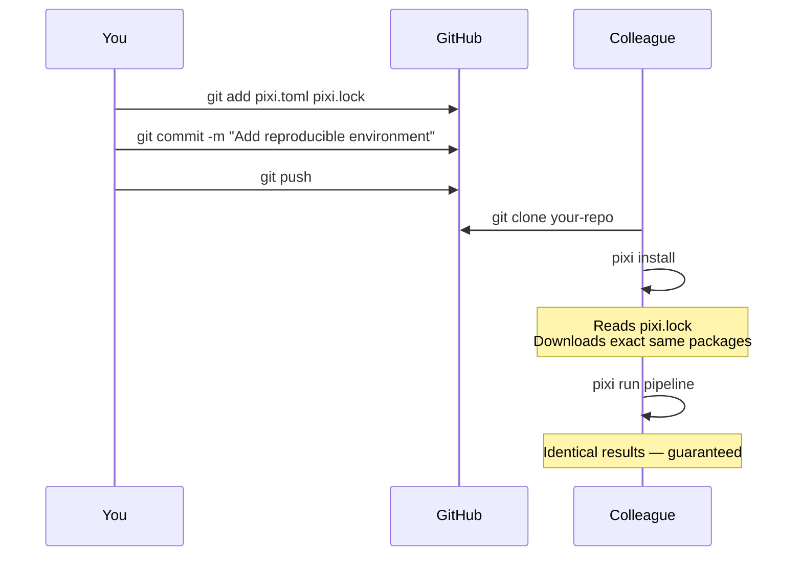
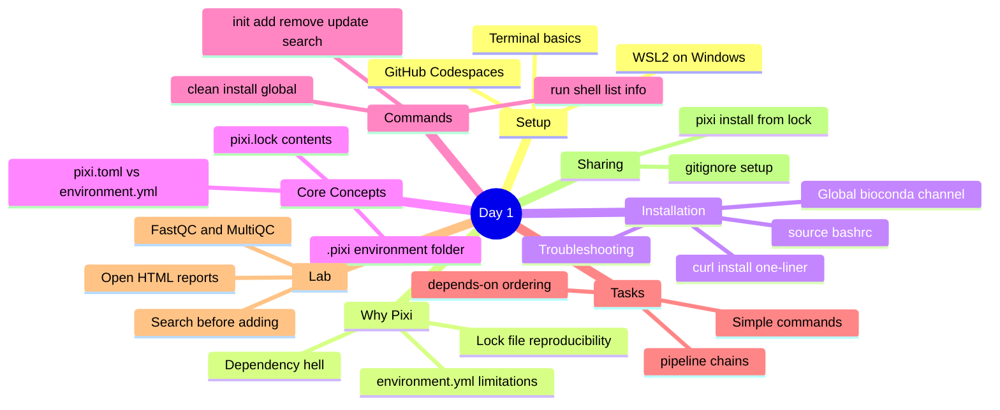

# Day 1: Simplify Your Bioinformatics Workflow with Pixi
### A Fresh Take on Conda · 21:00 – 23:00

---

## 🎯 Day 1 Learning Objectives

By the end of today, you will be able to:

- Explain why package management is essential in bioinformatics
- Launch a ready-to-use Linux environment via GitHub Codespaces (recommended)
- Set up a Linux terminal on Windows using WSL2 (local alternative)
- Navigate the terminal with basic Linux commands
- Install and configure Pixi on your machine
- Understand the difference between `environment.yml` (Conda) and `pixi.toml` (Pixi)
- Create a Pixi project and add bioinformatics tools
- Use all essential Pixi commands — add, remove, update, search, run, shell, and more
- Define and run tasks from a `pixi.toml` file
- Share a reproducible environment with collaborators

---

## Session 1 · Welcome and Introductions (21:00 – 21:10)

### Workshop Ground Rules

- Keep your mic muted unless speaking
- Use the chat box for quick questions; raise your hand icon for detailed ones
- All sessions are recorded and shared after the workshop
- Hands-on labs use small public datasets — no data upload needed

### Pre-check: How Will You Connect Today?

We recommend **GitHub Codespaces** for this workshop — it gives everyone an identical Linux environment in the browser with zero setup. Local options are also fully supported.

| Setup option | Who it is for | What to do |
|---|---|---|
| ⭐ **GitHub Codespaces** | **Everyone — recommended** | Click the workshop link — nothing to install |
| **Linux** (Ubuntu, Debian, Fedora) | Local Linux users | Open a terminal — you are ready |
| **macOS** | Local Mac users | Applications → Utilities → Terminal |
| **Windows 10 / 11** | Prefer local setup | Follow the WSL2 section below |

### Quick Test: Can You Open a Terminal?

Open a terminal and type the following. It is fine if some commands fail — we will fix everything today.

```bash
# Print your username
whoami

# Print operating system info
uname -a

# Check if Python exists (may or may not be installed)
python --version

# Check if conda exists (may or may not be installed)
conda --version
```

---

## Session 2 · Option A — GitHub Codespaces (Recommended) (21:10 – 21:20)

> **This is the recommended path for everyone.** You get a full Ubuntu 22.04 environment with Docker, Java, and Pixi pre-installed — right in your browser. No installation, no OS differences, no "works on my machine" problems.

### What is GitHub Codespaces?

Codespaces is a cloud development environment hosted by GitHub. When you open the workshop Codespace, GitHub spins up a virtual machine running Ubuntu 22.04, opens VS Code in your browser, and connects your terminal directly to that machine. From that point on, everything works exactly as if you were sitting in front of a Linux computer.



### Step 1: Create a GitHub Account

Go to https://github.com and sign up for a free account if you do not have one. No payment details are required.

> GitHub gives every free account **120 core-hours per month**. The full 3-day workshop uses roughly 6 core-hours — well within the free limit.

### Step 2: Open the Workshop Codespace

Click the link below to open the workshop environment directly in your browser:

> ### 👉 [Open Workshop Codespace](https://opulent-pancake-6r4p4qjr9xxhrw9w.github.dev/)

Or open it manually from the repository page:

1. Go to [github.com/hossainlab/bioinfo_workflow](https://github.com/hossainlab/bioinfo_workflow)
2. Click the green **`<> Code`** button
3. Select the **Codespaces** tab
4. Click **"Create codespace on main"**

> The first launch takes **2–3 minutes** while GitHub builds your container. Subsequent launches open in seconds because the image is cached.

### Step 3: Understand the Codespace Layout

When the environment opens you will see VS Code running in your browser with three main areas:

| Area | Location | What it is |
|------|----------|------------|
| **File Explorer** | Left sidebar | Browse project files — `pixi.toml`, `docs/`, `data/` |
| **Editor** | Centre panel | Open and edit files by clicking them |
| **Terminal** | Bottom panel | Your Linux command line — type commands here |

To open a terminal if it is not visible: go to **Terminal → New Terminal** in the top menu bar, or press `` Ctrl + ` ``.

Your terminal prompt will look like this:

```bash
@username ➜ /workspaces/bioinfo_workflow $
```

Click inside the terminal and you are ready to go.

### Step 4: Verify Everything is Pre-installed

Run these checks in the terminal:

```bash
# Confirm you are on Linux
uname -a
# Linux codespaces-xxxxx 6.x.x ... x86_64 GNU/Linux

# Confirm Pixi is installed
pixi --version
# pixi 0.x.x

# Confirm Docker is available
docker --version
# Docker version 24.x.x

# Confirm Java is available (needed for Nextflow on Day 3)
java -version
# openjdk version "21.x.x"

# Confirm channels are configured
pixi config list --global
# default-channels = ["conda-forge", "bioconda"]
```

If all four commands return version numbers, your environment is fully ready. Skip ahead to Session 3.

### Step 5: Stop Your Codespace After Each Session

A running Codespace consumes your free hours. **Always stop it when you are done for the day** — your files are saved automatically.

Go to https://github.com/codespaces, find your Codespace, and click **Stop**.

> Stopping is different from deleting. A stopped Codespace preserves all your files and resumes in seconds next time. Deleting removes everything permanently.

---

## Session 2 · Option B — Setting Up Ubuntu on Windows with WSL2 (21:10 – 21:25)

> **Windows users who prefer a local setup.** If you are using Codespaces, skip this section entirely and go to Session 3.

WSL stands for **Windows Subsystem for Linux**. It lets you run a real Ubuntu Linux environment directly inside Windows — no dual-boot, no virtual machine, no hassle.

### Why Do We Need Linux for Bioinformatics?

Most bioinformatics tools — FastQC, Samtools, BWA, Nextflow — were built for Linux. They depend on Linux system libraries and shell behavior. WSL2 gives you a genuine Linux kernel running right inside Windows.

### Step 1: Enable WSL2

Open **PowerShell as Administrator** (right-click the Start menu → Windows PowerShell (Admin)) and run:

```powershell
wsl --install
```

This single command enables the WSL feature, installs the Linux kernel update, and sets WSL2 as the default. When finished, **restart your computer**.

### Step 2: Install Ubuntu from the Microsoft Store

After restarting, open the **Microsoft Store**, search for **Ubuntu 22.04 LTS**, and click **Install**.

Once installed, launch Ubuntu from the Start menu. You will be asked to create a username and password:

```
Enter new UNIX username: yourname
New password:           (nothing appears as you type — this is normal)
Retype new password:
passwd: password updated successfully
```

### Step 3: Install Windows Terminal

Install **Windows Terminal** from the Microsoft Store for a more comfortable experience. After installation, click the dropdown arrow next to the `+` tab to open an Ubuntu session.

### Step 4: Update Ubuntu and Install Essential Tools

```bash
sudo apt update && sudo apt upgrade -y
sudo apt install -y curl wget git unzip zip build-essential
```

> `sudo` means "run as administrator". These tools are needed by nearly every bioinformatics installer.

---

## Session 3 · Basic Linux Commands for Everyone (21:25 – 21:40)

> **Everyone joins here** — Codespaces, WSL2, macOS, or native Linux. All commands are identical across all platforms from this point on.

### Navigating the Filesystem

```bash
# Where am I right now?
pwd
# /home/yourname

# List files in the current directory
ls

# List with details: permissions, size, date
ls -la

# Move into a folder
cd projects

# Move up one level
cd ..

# Go to your home folder from anywhere
cd ~

# Jump to an absolute path
cd /home/yourname/projects
```

> **Tip:** Press `Tab` to autocomplete file and folder names. Press `Tab` twice to see all matching options.

### Creating and Managing Files

```bash
# Create a new folder
mkdir my-project

# Create nested folders in one command (-p creates parents too)
mkdir -p my-project/data/raw

# Create an empty file
touch notes.txt

# Write text into a file
echo "Hello from the terminal" > notes.txt

# Read a file's contents
cat notes.txt

# Copy a file
cp notes.txt notes_backup.txt

# Move or rename a file
mv notes.txt readme.txt

# Delete a file (no recycle bin — permanent!)
rm notes_backup.txt

# Delete a folder and all its contents
rm -rf old-project/
```

> **Warning:** `rm -rf` permanently deletes with no undo. Always double-check the path.

### Viewing Files

```bash
# View a large file one screen at a time (q to quit, arrows to scroll)
less bigfile.txt

# First 10 lines
head sample.fastq

# Last 10 lines
tail sample.fastq

# Count lines in a file
wc -l sample.fastq

# Search for a pattern
grep "ATCG" sample.fastq
```

### Essential Keyboard Shortcuts

| Shortcut | Action |
|---|---|
| `Tab` | Autocomplete file or folder names |
| `↑` arrow | Recall previous command |
| `Ctrl + C` | Cancel the running command |
| `Ctrl + L` | Clear the screen |
| `Ctrl + A` | Jump to start of the line |
| `Ctrl + E` | Jump to end of the line |
| `history` | Show all past commands |

---

## ☕ Break (21:40 – 21:45)

---

## Session 4 · Why Package Management Matters (21:45 – 21:55)

### The Problem: Dependency Hell

Imagine you want to run a simple RNA-seq analysis. You need FastQC, STAR, DESeq2, and Samtools. Each tool requires specific versions of Python, R, libraries, and compilers. Installing them all on the same machine almost always causes conflicts:

```
ERROR: package 'htslib 1.16' requires 'zlib >= 1.2.11'
       but 'zlib 1.2.8' is currently installed.

       Cannot install 'samtools 1.17' because 'samtools 1.14'
       is required by 'bcftools 1.15'.
```

This is **dependency hell** — and it has cost bioinformaticians thousands of hours.

### How the Ecosystem Evolved



### The Conda Way: environment.yml

If you have used Conda before, you are familiar with `environment.yml`. Here is a typical example:

```yaml
# environment.yml — the Conda approach
name: rnaseq-env
channels:
  - conda-forge
  - bioconda
  - defaults
dependencies:
  - python=3.10
  - fastqc>=0.12
  - multiqc>=1.14
  - samtools>=1.17
  - pip:
    - some-python-package
```

**To use it:**

```bash
# Create the environment
conda env create -f environment.yml

# Activate it every time you open a terminal
conda activate rnaseq-env

# Run your tool
fastqc --version

# Deactivate when done
conda deactivate
```

**The problems with this approach:**

| Problem | What happens in practice |
|---|---|
| Slow solver | Can take 10–30 minutes to resolve environments |
| Global state | All environments share one Conda installation |
| No lock file | `environment.yml` records loose version ranges — different installs get different exact versions |
| No task runner | You must write separate shell scripts for each analysis step |
| Activation required | You must remember to `conda activate` every session |
| No project isolation | One broken environment can affect others |

### The Pixi Way: pixi.toml

Pixi replaces `environment.yml` with `pixi.toml` — and adds a proper lock file, a built-in task runner, and project isolation:

```toml
# pixi.toml — the Pixi approach
[project]
name = "rnaseq-env"
channels = ["conda-forge", "bioconda"]
platforms = ["linux-64"]

[dependencies]
python = ">=3.10"
fastqc = ">=0.12"
multiqc = ">=1.14"
samtools = ">=1.17"

[tasks]
qc = "fastqc data/raw/*.fastq.gz -o results/qc/"
```

**To use it:**

```bash
# Install the environment (first time only)
pixi install

# Run your tool — no activation needed
pixi run fastqc --version

# Run a named task from pixi.toml
pixi run qc

# Open an interactive shell with the env active
pixi shell
```

### Side-by-Side: Conda vs Pixi

| Feature | Conda + environment.yml | Pixi + pixi.toml |
|---|---|---|
| Speed | Slow Python solver (minutes) | Fast Rust-based solver (seconds) |
| Lock file | None — different installs diverge | `pixi.lock` — exact byte-for-byte reproducibility |
| Project isolation | Shared global environments | Per-project, fully self-contained |
| Task runner | None — write shell scripts yourself | Built-in `[tasks]` section |
| Shell activation | `conda activate env` every session | `pixi run cmd` — no activation needed |
| Sharing | Share `environment.yml` (approximate) | Share `pixi.lock` (exact versions + hashes) |



---

## Session 5 · Installing and Configuring Pixi (21:55 – 22:05)

### How Pixi Works Under the Hood



> Packages are downloaded only once and stored in `~/.pixi/cache`. If two projects both need `samtools 1.17`, the files are shared — saving disk space and install time.

### Installing Pixi

> **Codespaces users:** Pixi is already installed. Run `pixi --version` to confirm and skip to channel configuration below.

**Linux, macOS, and WSL2 — one command:**

```bash
curl -fsSL https://pixi.sh/install.sh | bash
```

You will see output ending with:

```
Please restart or source your shell.
```

Apply the change immediately — no need to close the terminal:

```bash
source ~/.bashrc
```

> `~/.bashrc` runs every time you open a new terminal. The Pixi installer adds itself to this file so `pixi` is found on your PATH. `source` re-runs the file in your current session without opening a new one.

**macOS (if you use zsh instead of bash):**

```bash
source ~/.zshrc
```

**Windows PowerShell (native, not WSL):**

```powershell
iwr -useb https://pixi.sh/install.ps1 | iex
```

### Verify the Installation

```bash
pixi --version
```

Expected output:

```
pixi 0.x.x
```

**Troubleshooting — if you see `command not found`:**

```bash
# Option 1: re-source your shell config
source ~/.bashrc          # Linux / WSL2
source ~/.zshrc           # macOS

# Option 2: add pixi to PATH manually this session
export PATH="$HOME/.pixi/bin:$PATH"

# Option 3: close and reopen the terminal completely, then try again
```

### Configure Bioconda as a Default Channel

By default Pixi only searches `conda-forge`. Bioinformatics tools live in `bioconda`. Add both globally so every new project finds them automatically:

```bash
pixi config set default-channels '["conda-forge", "bioconda"]' --global
```

Confirm the setting saved:

```bash
pixi config list --global
```

Expected output:

```toml
default-channels = ["conda-forge", "bioconda"]
```

> The `--global` flag writes to `~/.pixi/config.toml`. Without it, the change would only apply to your current project directory.

You can also view the config file directly:

```bash
cat ~/.pixi/config.toml
```

---

## Session 6 · Pixi Core Concepts and Commands (22:05 – 22:20)

### The Three Files Every Pixi Project Has



### Understanding pixi.toml — Every Section Explained

```toml
[project]
name = "rnaseq-workshop"       # your project name — no spaces
version = "0.1.0"              # version of your project
description = "My RNA-seq analysis"
channels = ["conda-forge", "bioconda"]  # where to search for packages
platforms = ["linux-64"]       # which OS platforms this project supports
                               # linux-64, osx-arm64, osx-64, win-64

[dependencies]
# Package version specifiers — pick the style that fits your need:
python = ">=3.10"          # 3.10 or newer (most flexible)
fastqc = ">=0.12,<1"       # 0.12 or newer, but NOT version 1.x
samtools = "==1.17"        # exactly version 1.17 (most strict)
multiqc = "*"              # any version (least strict — not recommended)
trimmomatic = ">=0.39"

[tasks]
# Simple one-liner task
qc = "fastqc data/raw/*.fastq.gz -o results/qc/ -t 4"

# Task with a dependency — multiqc only runs AFTER qc completes
multiqc = { cmd = "multiqc results/qc/ -o results/multiqc/", depends-on = ["qc"] }

# Chain multiple tasks together into a full pipeline
pipeline = { depends-on = ["qc", "multiqc"] }

# Utility task
clean = "rm -rf results/"
```

**Version specifier cheat sheet:**

| Specifier | Meaning | Example |
|---|---|---|
| `>=1.17` | version 1.17 or newer | `samtools = ">=1.17"` |
| `==1.17` | exactly version 1.17 | `samtools = "==1.17"` |
| `>=1.17,<2` | 1.17 or newer, but not 2.0 | `samtools = ">=1.17,<2"` |
| `*` | any version | `samtools = "*"` |

### What pixi.lock Actually Looks Like

When you run `pixi add`, Pixi updates `pixi.lock` automatically. Here is a small snippet so you know what is inside — you never need to edit this file:

```yaml
# pixi.lock (auto-generated — never edit manually)
version: 5
environments:
  default:
    packages:
      linux-64:
      - conda: https://conda.anaconda.org/bioconda/linux-64/fastqc-0.12.1-hdfd78af_0.conda
          build: hdfd78af_0
          build_number: 0
          name: fastqc
          sha256: 3a8e4c2d...          # exact hash — guarantees identical download
          version: 0.12.1
```

> The `sha256` hash is the key to reproducibility. When a colleague runs `pixi install`, Pixi checks that the downloaded file matches this exact hash — byte for byte. If anything has changed, the install fails rather than silently installing the wrong version.

### Migrating from Conda: environment.yml → pixi.toml

If you already have a Conda `environment.yml`, here is how to translate it:

**Your existing `environment.yml`:**

```yaml
name: myenv
channels:
  - conda-forge
  - bioconda
dependencies:
  - python=3.10
  - fastqc>=0.12
  - samtools>=1.17
  - multiqc
```

**Equivalent `pixi.toml`:**

```toml
[project]
name = "myenv"
channels = ["conda-forge", "bioconda"]
platforms = ["linux-64"]

[dependencies]
python = ">=3.10"
fastqc = ">=0.12"
samtools = ">=1.17"
multiqc = "*"
```

Then run `pixi install` — Pixi resolves the full environment and writes a `pixi.lock` with exact versions.

### Complete Pixi Command Reference

#### Starting a Project

```bash
# Create a new Pixi project in a new folder
pixi init myproject
cd myproject

# Create a Pixi project in the current folder
pixi init .

# Install the environment from an existing pixi.lock
# (use this when you clone someone else's project)
pixi install
```

#### Adding and Removing Packages

```bash
# Add one package
pixi add fastqc

# Add multiple packages at once
pixi add fastqc multiqc samtools

# Add with a version constraint
pixi add "samtools>=1.17"

# Add an exact version
pixi add "fastqc==0.12.1"

# Remove a package you no longer need
pixi remove multiqc

# Remove multiple packages
pixi remove fastqc multiqc
```

#### Searching for Packages

```bash
# Search for a package by name — shows available versions
pixi search samtools

# Search in a specific channel
pixi search samtools --channel bioconda

# Search for packages matching a keyword
pixi search "bwa"
```

#### Updating Packages

```bash
# Update one package to the latest version that satisfies your constraints
pixi update samtools

# Update all packages
pixi update

# Update and also update the lock file
pixi update --manifest-path pixi.toml
```

#### Running Commands and Tasks

```bash
# Run any tool from your project environment (no activation needed)
pixi run fastqc --version
pixi run samtools --version
pixi run python --version
pixi run python myscript.py

# Run a named task defined in [tasks]
pixi run qc
pixi run multiqc
pixi run pipeline

# Open an interactive shell with your environment activated
# (like conda activate, but only for this project)
pixi shell

# When inside pixi shell, you can run tools directly without pixi run:
fastqc --version
samtools --version
exit   # or Ctrl+D to leave the shell
```

#### Inspecting Your Project

```bash
# List all installed packages with their exact versions
pixi list

# Show detailed project info: environment path, channels, platforms
pixi info

# List all tasks defined in pixi.toml
pixi task list
```

#### Cleaning Up

```bash
# Remove the installed environment (.pixi/ folder)
# Safe to do — recreate at any time with pixi install
pixi clean

# What to commit to git (always):
#   pixi.toml
#   pixi.lock
#
# What NOT to commit (add to .gitignore):
#   .pixi/
#   results/
#   data/raw/*.fastq.gz
```

#### Installing Tools Globally (Without a Project)

Sometimes you just want a tool available everywhere on your machine — similar to `conda install` in the base environment:

```bash
# Install a tool globally (available in any terminal, not tied to a project)
pixi global install fastqc
pixi global install samtools

# List globally installed tools
pixi global list

# Remove a globally installed tool
pixi global remove fastqc
```

> Use `pixi global` sparingly. For reproducible science, prefer creating a project with `pixi init` so your environment is tracked and shareable.

---

## Session 7 · Lab: Your First Pixi Project (22:20 – 22:45)

### Lab Goal

Build a Pixi project that runs FastQC and MultiQC on real public FASTQ files. By the end you will have a working, reproducible quality-control pipeline you can adapt to your own data.

### Step 1: Create the Project

```bash
# Create a new folder and initialize a Pixi project in it
mkdir ngs-workshop && cd ngs-workshop
pixi init .
```

Inspect what was created:

```bash
ls -la
cat pixi.toml
```

You will see the initial `pixi.toml`:

```toml
[project]
name = "ngs-workshop"
version = "0.1.0"
description = ""
channels = ["conda-forge", "bioconda"]
platforms = ["linux-64"]

[tasks]

[dependencies]
```

> Pixi pre-fills the channels from your global config. Because you set `conda-forge` and `bioconda` earlier, both appear here automatically.

### Step 2: Search for and Add Tools

Let us practice `pixi search` before adding packages:

```bash
# Search for fastqc — check what versions are available
pixi search fastqc

# Search for multiqc
pixi search multiqc
```

Now add both tools:

```bash
pixi add fastqc multiqc
```

Watch Pixi resolve the dependency graph — it finds Java for FastQC and Python + dependencies for MultiQC, all in seconds.

Verify both tools are available:

```bash
pixi run fastqc --version
# FastQC v0.12.1

pixi run multiqc --version
# multiqc, version 1.x.x
```

Check your `pixi.toml` — it was updated automatically:

```bash
cat pixi.toml
```

```toml
[project]
name = "ngs-workshop"
version = "0.1.0"
description = ""
channels = ["conda-forge", "bioconda"]
platforms = ["linux-64"]

[tasks]

[dependencies]
fastqc = ">=0.12.1,<0.13"
multiqc = ">=1.14,<2"
```

And check that `pixi.lock` was created:

```bash
ls -la pixi.lock   # should show a large file — hundreds of lines
```

### Step 3: Create Project Folder Structure

```bash
mkdir -p data/raw results/qc results/multiqc
```

Your project now looks like:

```
ngs-workshop/
├── pixi.toml
├── pixi.lock
├── .pixi/          <- installed tools live here
├── data/
│   └── raw/        <- put FASTQ files here
└── results/
    ├── qc/         <- FastQC outputs go here
    └── multiqc/    <- MultiQC report goes here
```

### Step 4: Download Test FASTQ Data

```bash
cd data/raw

curl -L -O https://raw.githubusercontent.com/nf-core/test-datasets/rnaseq/testdata/GSE49457/SRR493366_1.fastq.gz
curl -L -O https://raw.githubusercontent.com/nf-core/test-datasets/rnaseq/testdata/GSE49457/SRR493366_2.fastq.gz

cd ../..
ls data/raw/
```

> These two files are **paired-end reads** — `_1` is the forward read and `_2` is the reverse read from the same sequencing experiment. `-L` tells curl to follow redirects; `-O` saves the file with its original name.

### Step 5: Add Tasks to pixi.toml

Open `pixi.toml` in the text editor:

```bash
nano pixi.toml
```

Replace the empty `[tasks]` section with:

```toml
[tasks]
qc = "fastqc data/raw/*.fastq.gz -o results/qc/ -t 4"
multiqc = { cmd = "multiqc results/qc/ -o results/multiqc/", depends-on = ["qc"] }
pipeline = { depends-on = ["qc", "multiqc"] }
clean = "rm -rf results/"
```

Save: press `Ctrl+O` then `Enter`, then exit with `Ctrl+X`.

Confirm your tasks registered:

```bash
pixi task list
```

```
Tasks:
  clean
  multiqc
  pipeline
  qc
```

### Step 6: Run the Pipeline

```bash
# Run only FastQC
pixi run qc

# Run MultiQC — this automatically runs qc first due to depends-on
pixi run multiqc

# Or run both in the correct order with a single command
pixi run pipeline
```

FastQC processes both FASTQ files in parallel, then MultiQC aggregates all results into one HTML report.

### Step 7: Explore the Results

```bash
ls results/qc/
ls results/multiqc/
```

**On Codespaces:** In the VS Code file explorer on the left, find `results/multiqc/multiqc_report.html`, right-click it, and choose **Open with Live Server** or click it directly — VS Code opens it in your browser automatically.

```bash
# Or serve it from the terminal:
cd results/multiqc && python3 -m http.server 8080
# Click the "Open in Browser" pop-up in the bottom-right corner of VS Code
```

**On WSL2 (Windows):**

```bash
explorer.exe results/multiqc/multiqc_report.html
```

**On macOS:**

```bash
open results/multiqc/multiqc_report.html
```

### Step 8: Inspect the Full Lock File

Look at a few lines of `pixi.lock` to understand what exact reproducibility means:

```bash
head -50 pixi.lock
```

You will see URLs, exact version numbers, and SHA256 hashes for every package. This is what guarantees that your collaborator gets the identical environment.

### Final Project Structure

```
ngs-workshop/
├── pixi.toml              ← your config (edit this)
├── pixi.lock              ← auto-generated (always commit to git)
├── .pixi/                 ← installed environment (never commit — add to .gitignore)
├── data/
│   └── raw/
│       ├── SRR493366_1.fastq.gz
│       └── SRR493366_2.fastq.gz
└── results/
    ├── qc/
    │   ├── SRR493366_1_fastqc.html
    │   └── SRR493366_2_fastqc.html
    └── multiqc/
        └── multiqc_report.html    ← open this in your browser
```

---

## Session 8 · Reproducibility and Sharing (22:45 – 22:55)

### Why pixi.lock Changes Everything



### Sharing Your Project with a Collaborator



### Set Up .gitignore

Create a `.gitignore` to keep your repository clean:

```bash
cat > .gitignore << 'EOF'
# Pixi environment — can be recreated from pixi.lock
.pixi/

# Analysis outputs — usually too large for git
results/

# Raw data — usually too large for git
data/raw/*.fastq.gz
data/raw/*.bam

# Log files
*.log
*.tmp
EOF
```

**What to always commit:**

| File | Why |
|---|---|
| `pixi.toml` | Your tool list and task definitions |
| `pixi.lock` | Exact versions for full reproducibility |
| `scripts/` | Your analysis scripts |
| Small reference files | If they are small enough |

**What to never commit:**

| File | Why |
|---|---|
| `.pixi/` | Gigabytes of binaries — regenerated by `pixi install` |
| `results/` | Outputs are regenerated by running the pipeline |
| Large data files | Use a data repository (Zenodo, SRA) instead |

---

## Session 9 · Q&A and Day 1 Recap (22:55 – 23:00)

### What We Covered Today



### Day 1 Complete Command Reference

| Task | Command |
|---|---|
| **Setup** | |
| Install Pixi | `curl -fsSL https://pixi.sh/install.sh \| bash` |
| Apply install | `source ~/.bashrc` |
| Set global channels | `pixi config set default-channels '["conda-forge","bioconda"]' --global` |
| Check config | `pixi config list --global` |
| **Projects** | |
| New project | `pixi init myproject` |
| Install from lock | `pixi install` |
| **Packages** | |
| Search | `pixi search samtools` |
| Add | `pixi add fastqc multiqc` |
| Add with version | `pixi add "samtools>=1.17"` |
| Remove | `pixi remove multiqc` |
| Update | `pixi update samtools` |
| Update all | `pixi update` |
| **Running** | |
| Run a tool | `pixi run fastqc --version` |
| Run a task | `pixi run qc` |
| Interactive shell | `pixi shell` |
| **Inspecting** | |
| List packages | `pixi list` |
| Project info | `pixi info` |
| List tasks | `pixi task list` |
| **Cleanup** | |
| Delete env | `pixi clean` |
| Global install | `pixi global install fastqc` |
| **Codespaces** | |
| Open environment | https://opulent-pancake-6r4p4qjr9xxhrw9w.github.dev/ |
| Stop Codespace | https://github.com/codespaces → Stop |

---

### Preview: Day 2

Tomorrow we answer: **"Pixi sets up tools on my laptop — but what if I need to run on an HPC cluster, a colleague's server, or the cloud where I cannot install Pixi?"**

That is where Docker comes in. We will package tools and their entire runtime into a container that runs identically on any machine — no installation required on the target system.

See you tomorrow! 🐳
