# Day 1: Simplify Your Bioinformatics Workflow with Pixi
### A Fresh Take on Conda · 09:00 – 12:45

---

## 🎯 Day 1 Learning Objectives

By the end of today, you will be able to:

- Explain why package management is essential in bioinformatics
- Launch a ready-to-use Linux environment via GitHub Codespaces (recommended)
- Set up a Linux terminal on Windows using WSL2 (local alternative)
- Navigate the terminal with basic Linux commands
- Install and configure Pixi on your machine
- Create a Pixi project and add bioinformatics tools
- Define and run tasks from a `pixi.toml` file
- Share a reproducible environment with collaborators

---

## Session 1 · Welcome and Introductions (09:00 – 09:15)

### Workshop Ground Rules

- Keep your mic muted unless speaking
- Use the chat box for quick questions; raise your hand icon for detailed ones
- All sessions are recorded and shared after the workshop
- Hands-on labs use small public datasets — no data upload needed

### Pre-check: How Will You Connect Today?

We recommend **GitHub Codespaces** for this workshop — it gives everyone an identical Linux environment in the browser with zero setup. Local options are also fully supported.

| Setup option | Who it is for | What to do |
|---|---|---|
| ⭐ **GitHub Codespaces** | **Everyone — recommended** | Click the workshop link — nothing to install |
| **Linux** (Ubuntu, Debian, Fedora) | Local Linux users | Open a terminal — you are ready |
| **macOS** | Local Mac users | Applications → Utilities → Terminal |
| **Windows 10 / 11** | Prefer local setup | Follow the WSL2 section below |

### Quick Test: Can You Open a Terminal?

Open a terminal and type the following. It is fine if some commands fail — we will fix everything today.

```bash
# Print your username
whoami

# Print operating system info
uname -a

# Check if Python exists (may or may not be installed)
python --version

# Check if conda exists (may or may not be installed)
conda --version
```

---

## Session 2 · Option A — GitHub Codespaces (Recommended) (09:15 – 09:30)

> **This is the recommended path for everyone.** You get a full Ubuntu 22.04 environment with Docker, Java, and Pixi pre-installed — right in your browser. No installation, no OS differences, no "works on my machine" problems.

### What is GitHub Codespaces?

Codespaces is a cloud development environment hosted by GitHub. When you open the workshop Codespace, GitHub spins up a virtual machine running Ubuntu 22.04, opens VS Code in your browser, and connects your terminal directly to that machine. From that point on, everything works exactly as if you were sitting in front of a Linux computer.

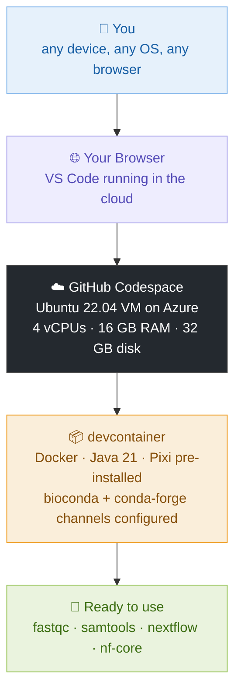

### Step 1: Create a GitHub Account

Go to https://github.com and sign up for a free account if you do not have one. No payment details are required.

> GitHub gives every free account **120 core-hours per month**. Your full 3-day workshop uses roughly 36 core-hours (9 hours × 4 cores) — well within the free limit.

### Step 2: Open the Workshop Codespace

Click the link your instructor shares, or go to the workshop repository and click:

**Code → Codespaces → Create codespace on main**

```
┌─────────────────────────────────────┐
│  <>  Code  ▼                        │
│  ┌─────────────────────────────┐    │
│  │ 📋 Local    ☁️ Codespaces   │    │
│  │                             │    │
│  │  ✨ Create codespace on main│    │
│  └─────────────────────────────┘    │
└─────────────────────────────────────┘
```

The first launch takes **2–3 minutes** as GitHub builds your container. Subsequent launches are much faster because the image is cached.

### Step 3: Understand the Codespace Layout

When the environment opens you will see VS Code in your browser:

```
┌─────────────────────────────────────────────────────────────┐
│  EXPLORER          │  README.md  ×                          │
│  📁 ngs-workshop   │                                        │
│    📄 pixi.toml    │  # Bioinformatics Workflow Bootcamp    │
│    📄 README.md    │  Welcome! Your environment is ready.  │
│    📁 data/        │                                        │
│    📁 scripts/     │                                        │
│                    │                                        │
├────────────────────┴────────────────────────────────────────│
│  TERMINAL                                                   │
│  @username ➜ /workspaces/ngs-workshop $                    │
│                                                             │
└─────────────────────────────────────────────────────────────┘
```

The **Terminal panel** at the bottom is your Linux command line. Click inside it and you are ready to go.

### Step 4: Verify Everything is Pre-installed

Run these checks in the terminal:

```bash
# Confirm you are on Linux
uname -a
# Linux codespaces-xxxxx 6.x.x ... x86_64 GNU/Linux

# Confirm Pixi is installed
pixi --version
# pixi 0.x.x

# Confirm Docker is available
docker --version
# Docker version 24.x.x

# Confirm Java is available (needed for Nextflow on Day 3)
java -version
# openjdk version "21.x.x"

# Confirm channels are configured
pixi config list --global
# default-channels = ["conda-forge", "bioconda"]
```

If all four commands return version numbers, your environment is fully ready. Skip ahead to Session 3.

### Step 5: Stop Your Codespace After Each Session

A running Codespace consumes your free hours. **Always stop it when you are done for the day** — your files are saved automatically.

Go to https://github.com/codespaces, find your Codespace, and click **Stop**.

> Stopping is different from deleting. A stopped Codespace preserves all your files and resumes in seconds next time. Deleting removes everything permanently.

### The devcontainer.json Behind the Scenes

The workshop environment is defined by a single config file committed to the repo. This is what gives everyone an identical setup:

```json
{
  "name": "Bioinformatics Workflow Bootcamp",
  "image": "mcr.microsoft.com/devcontainers/base:ubuntu-22.04",
  "features": {
    "ghcr.io/devcontainers/features/docker-in-docker:2": {},
    "ghcr.io/devcontainers/features/java:1": { "version": "21" }
  },
  "postCreateCommand": "curl -fsSL https://pixi.sh/install.sh | bash && source ~/.bashrc && pixi config set default-channels '[\"conda-forge\",\"bioconda\"]' --global",
  "customizations": {
    "vscode": {
      "extensions": [
        "ms-azuretools.vscode-docker",
        "charliermarsh.ruff",
        "ms-python.python"
      ]
    }
  },
  "remoteUser": "vscode"
}
```

> `postCreateCommand` runs once after the container is built. It installs Pixi and configures bioconda channels so everything is ready before you even open the terminal.

---

## Session 2 · Option B — Setting Up Ubuntu on Windows with WSL2 (09:15 – 09:45)

> **Windows users who prefer a local setup.** If you are using Codespaces, skip this section entirely and go to Session 3.

WSL stands for **Windows Subsystem for Linux**. It lets you run a real Ubuntu Linux environment directly inside Windows — no dual-boot, no virtual machine, no hassle.

### Why Do We Need Linux for Bioinformatics?

Most bioinformatics tools — FastQC, Samtools, BWA, Nextflow — were built for Linux. They depend on Linux system libraries and shell behavior. While some have Windows ports, they are often incomplete or behave differently. WSL2 gives you a genuine Linux kernel running right inside Windows.

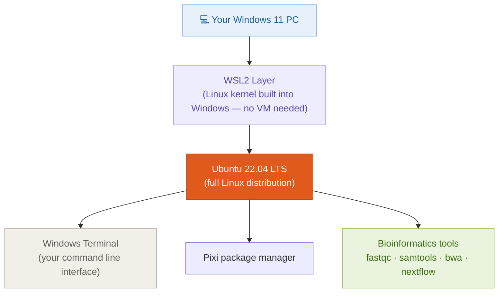

### Step 1: Enable WSL2

Open **PowerShell as Administrator** (right-click the Start menu → Windows PowerShell (Admin)) and run:

```powershell
wsl --install
```

This single command enables the WSL feature, installs the Linux kernel update, and sets WSL2 as the default. When finished, **restart your computer**.

> **Why restart?** WSL2 installs a kernel component that must be loaded at boot time.

### Step 2: Install Ubuntu from the Microsoft Store

After restarting, open the **Microsoft Store**, search for **Ubuntu 22.04 LTS**, and click **Install**.

Once installed, launch Ubuntu from the Start menu. The first launch takes 1–2 minutes as it sets up the filesystem. You will be asked to create a username and password:

```
Enter new UNIX username: yourname
New password:           (nothing appears as you type — this is normal)
Retype new password:
passwd: password updated successfully
```

> Your WSL password does not need to match your Windows password. Use something simple you will remember.

### Step 3: Install Windows Terminal

Windows Terminal is a much more comfortable experience than the default Ubuntu window. Install it from the **Microsoft Store** by searching "Windows Terminal". After installation, click the dropdown arrow next to the `+` tab button to open an Ubuntu session.

### Step 4: Update Ubuntu

Always update the package list immediately after a fresh Ubuntu install:

```bash
sudo apt update && sudo apt upgrade -y
```

> `sudo` means "run as administrator". `apt` is Ubuntu's built-in package manager. The `-y` flag auto-confirms so you do not need to type "yes" for each package.

### Step 5: Install Essential Tools

```bash
sudo apt install -y curl wget git unzip zip build-essential
```

> These are the foundational utilities used by nearly every bioinformatics installer: `curl` and `wget` download files from the internet, `git` manages code version control, and `build-essential` provides the C compilers some packages need.

---

## Session 3 · Basic Linux Commands for Everyone (09:45 – 10:15)

> **Everyone joins here** — whether you are on Codespaces, WSL2, macOS, or native Linux. From this point on, all commands are identical across all platforms.

### The Terminal: Your Scientific Command Center

The terminal is a text interface to your computer. You type a command, press Enter, and the system runs it. For scientific computing, the terminal is far more powerful than clicking through folders.


### Navigating the Filesystem

The Linux filesystem is a tree. Everything starts from the root `/`. Your home folder is `/home/yourusername`, which you can always write as `~`.

```bash
# Where am I right now?
pwd
# Output: /home/yourname

# List files and folders in the current directory
ls

# List with details: permissions, owner, size, date
ls -la

# Move into a folder
cd projects

# Move up one level
cd ..

# Go directly to your home folder from anywhere
cd ~

# Jump to an absolute path
cd /home/yourname/projects/ngs-workshop
```

> **Tip:** Press `Tab` to autocomplete folder and file names. If nothing happens, press `Tab` twice to see all matching options.

### Understanding File Paths

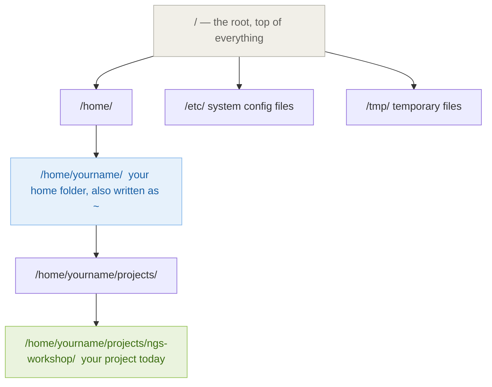

### Creating and Managing Files

```bash
# Create a new folder
mkdir my-project

# Create nested folders in one command
mkdir -p my-project/data/raw

# Create an empty file
touch notes.txt

# Write text into a file
echo "Hello from the terminal" > notes.txt

# Read a file's contents
cat notes.txt

# Copy a file
cp notes.txt notes_backup.txt

# Move or rename a file
mv notes.txt readme.txt

# Delete a file (no recycle bin — be careful!)
rm notes_backup.txt

# Delete a folder and everything inside it
rm -rf old-project/
```

> **Warning:** `rm -rf` permanently deletes files with no undo. Always double-check the path before running it.

### Viewing Files

```bash
# View a large file one screen at a time (press q to quit, arrows to scroll)
less bigfile.txt

# View the first 10 lines of a file
head sample.fastq

# View the last 10 lines
tail sample.fastq

# Count lines in a file
wc -l sample.fastq

# Search for a pattern inside a file
grep "ATCG" sample.fastq
```

### Keyboard Shortcuts Every Bioinformatician Uses

| Shortcut | Action |
|---|---|
| `Tab` | Autocomplete file or folder names |
| `↑` arrow | Recall previous command |
| `Ctrl + C` | Cancel the running command |
| `Ctrl + L` | Clear the screen |
| `Ctrl + A` | Jump to start of the line |
| `Ctrl + E` | Jump to end of the line |
| `history` | See all past commands |

---

## ☕ Break (10:15 – 10:25)

---

## Session 4 · Why Package Management Matters (10:25 – 10:50)

### The Problem: Dependency Hell

Imagine you want to run a simple RNA-seq analysis. You need:

- `FastQC` for quality control
- `STAR` for read alignment
- `DESeq2` for differential expression (an R package)
- `samtools` for BAM file handling

Each tool requires specific versions of Python, R, libraries, and compilers. Installing them all on the same machine almost always causes conflicts:

```
ERROR: package 'htslib 1.16' requires 'zlib >= 1.2.11'
       but 'zlib 1.2.8' is currently installed.

       Cannot install 'samtools 1.17' because 'samtools 1.14'
       is required by 'bcftools 1.15'.
```

This is **dependency hell** — and it has cost bioinformaticians thousands of hours.

### How the Ecosystem Evolved

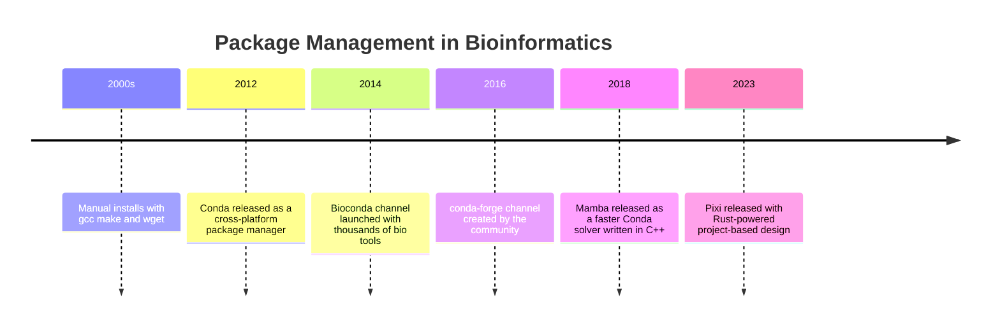

### Where Conda Struggles

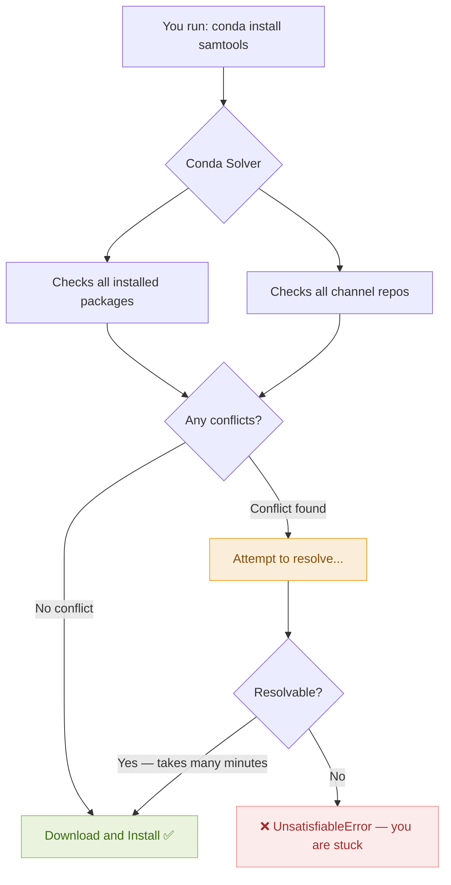

**Conda's main pain points:**

| Problem | What happens in practice |
|---|---|
| Slow solver | Can take 10–30 minutes to resolve environments |
| Global state | All environments share one Conda installation |
| No project isolation | Dependencies from one project affect another |
| Hard to reproduce | `environment.yml` does not lock exact versions |
| No task runner | You must write separate shell scripts |

### Enter Pixi: What Is Different?

```mermaid
flowchart TD
    subgraph Traditional["🐍 Traditional Conda Workflow"]
        A1["conda create -n proj1"] --> B1["conda activate proj1"]
        B1 --> C1["conda install tools..."]
        C1 --> D1["Save environment.yml<br/>(versions are approximate)"]
    end

    subgraph PixiWay["⚡ Pixi Workflow"]
        A2["pixi init myproject"] --> B2["pixi.toml created<br/>(your project config)"]
        B2 --> C2["pixi add samtools fastqc"]
        C2 --> D2["pixi.lock auto-generated<br/>(exact versions — fully reproducible)"]
        D2 --> E2["pixi run your-task"]
    end

    style PixiWay fill:#EAF3DE,color:#3B6D11,stroke:#97C459
    style Traditional fill:#FCEBEB,color:#A32D2D,stroke:#F09595
```

**Key advantages of Pixi:**

| Feature | Conda | Pixi |
|---|---|---|
| Speed | Slow Python solver | Very fast Rust-based solver |
| Project isolation | Global environments | Per-project, self-contained |
| Lock file | No | Yes — `pixi.lock` |
| Task runner | No | Yes — built-in |
| Shell activation | Required (`conda activate`) | Optional (`pixi run`) |

---

## Session 5 · Installing Pixi (10:50 – 11:10)

### How Pixi Works Under the Hood

Understanding the flow makes it much easier to debug problems later:

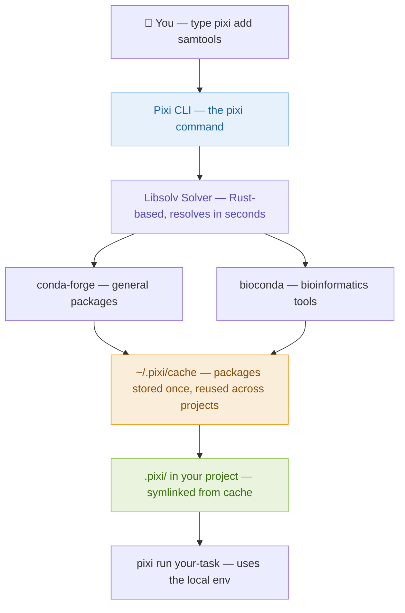

> The cache means packages are downloaded only once. If two projects both use `samtools 1.17`, it is stored once and linked into each project — saving disk space and installation time.

### Install Pixi (Linux, macOS, and WSL2)

> **Codespaces users:** Pixi is already installed in your environment. Run `pixi --version` to confirm and skip to the channel configuration step below.

```bash
curl -fsSL https://pixi.sh/install.sh | bash
```

> `curl` downloads the installer script. The `|` pipe passes it directly to `bash` which runs it. This is the standard installation pattern for modern CLI tools.

You will see output ending with:

```
Please restart or source your shell.
```

Apply the changes immediately without restarting your terminal:

```bash
source ~/.bashrc
```

> `~/.bashrc` is a script that runs every time you open a new terminal session. The Pixi installer adds a line to this file so that `pixi` is found on your PATH. Running `source` re-executes the file in your current session.

**On Windows PowerShell (if not using WSL):**

```powershell
iwr -useb https://pixi.sh/install.ps1 | iex
```

### Verify the Installation

```bash
pixi --version
```

Expected output:

```
pixi 0.x.x
```

If you see `command not found`, run `source ~/.bashrc` again, or close and reopen your terminal completely.

### Configure Bioconda as a Default Channel

By default Pixi only searches `conda-forge`. Bioinformatics tools live in `bioconda`. Add both globally so every new project finds bio tools automatically:

```bash
pixi config set default-channels '["conda-forge", "bioconda"]' --global
```

Confirm the setting saved:

```bash
pixi config list --global
```

Expected output:

```toml
default-channels = ["conda-forge", "bioconda"]
```

> The `--global` flag writes this to `~/.pixi/config.toml`. Without it, the change would only apply to your current project directory.

---

## Session 6 · Pixi Core Concepts (11:10 – 11:40)

### The Anatomy of a Pixi Project

Every Pixi project is a folder containing three key files:

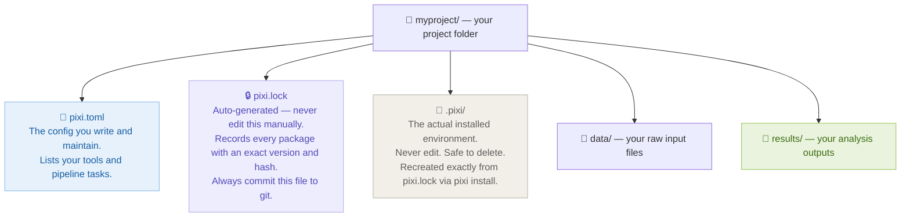

### Understanding pixi.toml

The `pixi.toml` file has four main sections. Here is a fully annotated example:

```toml
[project]
name = "rnaseq-workshop"
version = "0.1.0"
description = "My RNA-seq analysis project"
channels = ["conda-forge", "bioconda"]
platforms = ["linux-64", "osx-arm64", "win-64"]

[dependencies]
# >= means "this version or newer"
# == means "exactly this version"
fastqc = ">=0.12"
trimmomatic = ">=0.39"
star = ">=2.7"
samtools = ">=1.17"
multiqc = ">=1.14"
python = ">=3.10"

[tasks]
# A simple task — runs FastQC on all raw FASTQ files
qc = "fastqc data/raw/*.fastq.gz -o results/qc/"

# depends-on means this task only starts after qc finishes
trim = { cmd = "trimmomatic PE ...", depends-on = ["qc"] }

# A shortcut that chains multiple tasks together
pipeline = { depends-on = ["qc", "trim"] }
```

> Think of `[tasks]` as replacing your shell scripts. Instead of writing a `run_pipeline.sh` file and calling tools directly, you define named tasks here and run them with `pixi run taskname`.

### What Happens When You Run `pixi add`

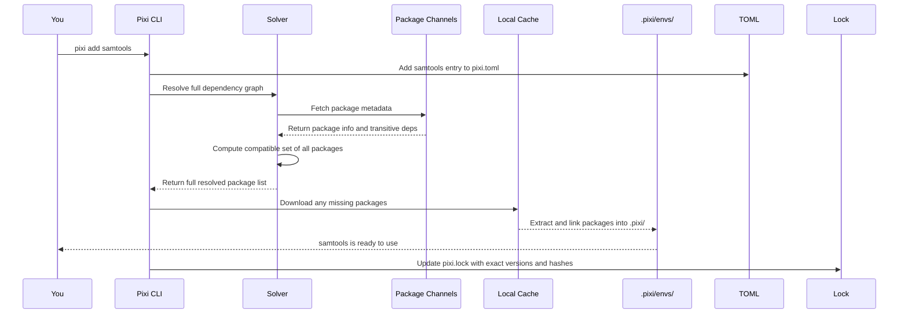

### Essential Pixi Commands

```bash
# Create a new Pixi project
pixi init myproject
cd myproject

# Add packages from bioconda or conda-forge
pixi add samtools
pixi add "samtools>=1.17"
pixi add fastqc multiqc

# Run a command using the project environment
pixi run samtools --version
pixi run python myscript.py
pixi run qc

# Open an interactive shell with the environment activated
pixi shell

# Inspect your project
pixi list
pixi info
pixi task list

# Recreate the environment from pixi.lock on any machine
pixi install

# Delete the installed environment (safe — recreate with pixi install)
pixi clean
```

---

## Session 7 · Lab: Your First Pixi Project (11:40 – 12:10)

### Lab Goal

Build a Pixi project that runs FastQC and MultiQC on sample FASTQ files. This is your first automated, reproducible bioinformatics workflow.

### Step 1: Create the Project

```bash
# Create a new folder and enter it
mkdir ngs-workshop && cd ngs-workshop

# Initialize a Pixi project in this folder
pixi init .
```

> The `.` means "current directory". Pixi creates a `pixi.toml` file here. You can also run `pixi init ngs-workshop` from the parent folder to create and initialize in one step.

Look at what was created:

```bash
ls -la
cat pixi.toml
```

You should see an initial `pixi.toml`:

```toml
[project]
name = "ngs-workshop"
version = "0.1.0"
description = ""
channels = ["conda-forge", "bioconda"]
platforms = ["linux-64"]

[tasks]

[dependencies]
```

### Step 2: Add Bioinformatics Tools

```bash
pixi add fastqc multiqc
```

> Pixi resolves the full dependency graph for both tools. FastQC needs Java; MultiQC needs Python and several Python packages. Pixi handles all of this automatically and records every resolved package in `pixi.lock`.

Verify the tools are available:

```bash
pixi run fastqc --version
# FastQC v0.12.1

pixi run multiqc --version
# multiqc, version 1.14
```

### Step 3: Create Your Project Folder Structure

Good folder organization is a habit that saves enormous confusion later:

```bash
mkdir -p data/raw results/qc results/multiqc
```

> The `-p` flag creates all parent directories that do not yet exist. Without `-p`, running `mkdir data/raw` would fail if `data/` does not already exist.

### Step 4: Download Test Data

Download small public FASTQ files from the nf-core test dataset repository:

```bash
cd data/raw

curl -L -O https://raw.githubusercontent.com/nf-core/test-datasets/rnaseq/testdata/GSE49457/SRR493366_1.fastq.gz
curl -L -O https://raw.githubusercontent.com/nf-core/test-datasets/rnaseq/testdata/GSE49457/SRR493366_2.fastq.gz

cd ../..
ls data/raw/
```

> `-L` tells curl to follow HTTP redirects (GitHub uses these). `-O` saves the file with its original name. These two files are **paired-end reads**: `_1` is the forward read and `_2` is the reverse read from the same sequencing run.

### Step 5: Add Tasks to pixi.toml

Open `pixi.toml` in the nano text editor:

```bash
nano pixi.toml
```

Replace the empty `[tasks]` section with:

```toml
[tasks]
qc = "fastqc data/raw/*.fastq.gz -o results/qc/ -t 4"
multiqc = { cmd = "multiqc results/qc/ -o results/multiqc/", depends-on = ["qc"] }
clean = "rm -rf results/"
```

Save: press `Ctrl+O` then Enter, then exit with `Ctrl+X`.

> The `depends-on = ["qc"]` key makes `multiqc` wait for `qc` to complete first. This turns your task list into a mini pipeline. The `-t 4` flag tells FastQC to use 4 CPU threads.

### Step 6: Run the Pipeline

```bash
# Run only FastQC
pixi run qc

# Run MultiQC (this automatically triggers qc first due to depends-on)
pixi run multiqc
```

Watch the output scroll by. FastQC processes both files, then MultiQC aggregates the results into a single report.

### Step 7: Open Your Results

```bash
ls results/qc/
ls results/multiqc/
```

**On Codespaces:** Right-click `results/multiqc/multiqc_report.html` in the VS Code file explorer on the left, then choose **Open with Live Server** or simply click the file — VS Code will offer to open it in a browser tab via port forwarding automatically.

Alternatively, use the terminal:

```bash
# Codespaces: open the file browser panel and click the HTML file directly
# Or run a quick local server:
cd results/multiqc
python3 -m http.server 8080
# Then click the "Open in Browser" pop-up that appears in the bottom-right corner
```

**On WSL2 (Windows):** Open the HTML report in your Windows browser:

```bash
explorer.exe results/multiqc/multiqc_report.html
```

**On macOS:**

```bash
open results/multiqc/multiqc_report.html
```

**On native Linux:**

```bash
xdg-open results/multiqc/multiqc_report.html
```

### Final Project Structure

```
ngs-workshop/
├── pixi.toml              <- your config (edit this)
├── pixi.lock              <- auto-generated (commit this to git)
├── .pixi/                 <- installed environment (never edit or commit)
├── data/
│   └── raw/
│       ├── SRR493366_1.fastq.gz
│       └── SRR493366_2.fastq.gz
└── results/
    ├── qc/
    │   ├── SRR493366_1_fastqc.html
    │   └── SRR493366_2_fastqc.html
    └── multiqc/
        └── multiqc_report.html   <- open this in your browser
```

---

## Session 8 · Reproducibility and Sharing (12:10 – 12:30)

### Why Reproducibility Matters

Science requires that results can be independently verified. In bioinformatics, a result is only reproducible if the exact same software versions were used. `pixi.lock` makes this guaranteed.

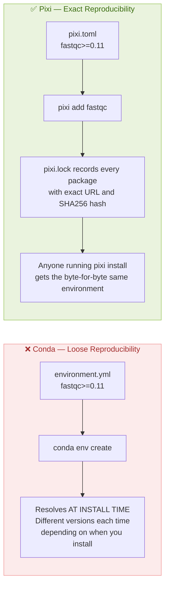

### Sharing Your Project with a Collaborator

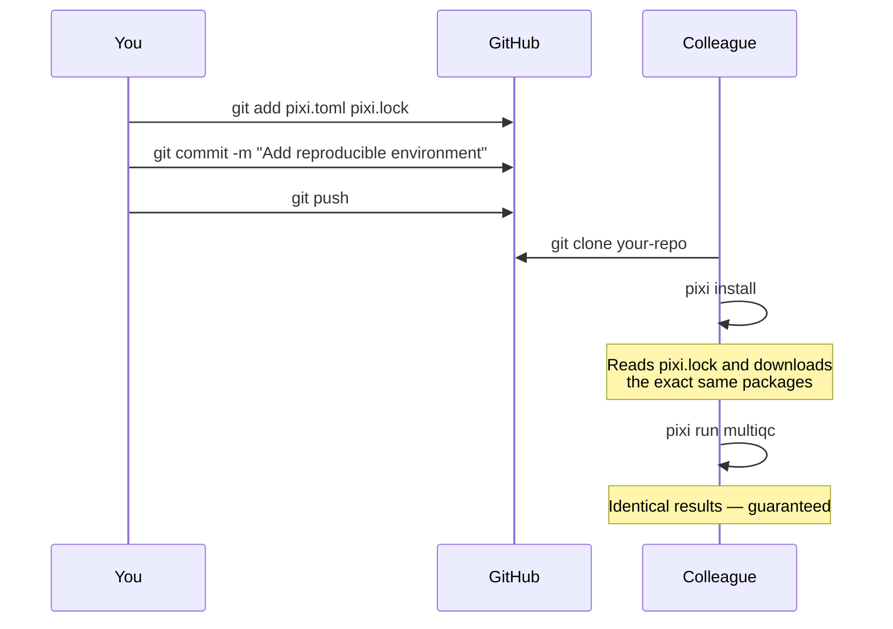

### What to Commit and What to Ignore

Create a `.gitignore` file to keep your repository clean:

```bash
cat > .gitignore << 'EOF'
# Always commit: pixi.toml, pixi.lock, scripts/, small data files

# Never commit these:
.pixi/
results/
*.log
*.tmp
EOF
```

> The `.pixi/` folder contains gigabytes of installed binaries. Never commit it. Anyone can recreate it exactly from `pixi.lock` by running `pixi install`.

---

## Session 9 · Q&A and Day 1 Recap (12:30 – 12:45)

### What We Covered Today

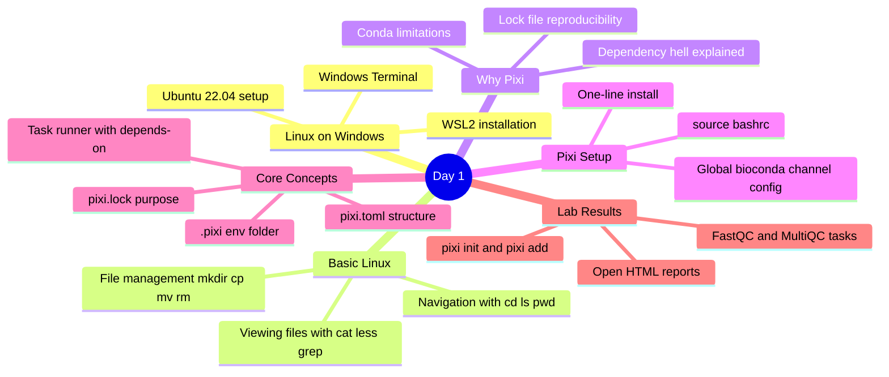

### Day 1 Quick Reference

| Task | Command / Action |
|---|---|
| Launch workshop environment | Click Codespace link → **Create codespace on main** |
| Stop Codespace after session | https://github.com/codespaces → **Stop** |
| New Pixi project | `pixi init myproject` |
| Add a package | `pixi add fastqc` |
| Add with version constraint | `pixi add "samtools>=1.17"` |
| Run a binary | `pixi run samtools --version` |
| Run a named task | `pixi run qc` |
| Open interactive shell | `pixi shell` |
| List installed packages | `pixi list` |
| Recreate env from lock | `pixi install` |
| Open HTML in Codespaces | Right-click file → Open in browser |
| Open HTML in Windows WSL | `explorer.exe file.html` |
| Open HTML on macOS | `open file.html` |

### Preview: Day 2

Tomorrow we answer: **"Pixi sets up tools on my laptop — but what if I need to run on an HPC cluster, a colleague's server, or the cloud where I cannot install Pixi?"**

That is where Docker comes in. See you tomorrow! 🐳
