# Day 2: Build Once, Run Anywhere
### Creating Portable NGS Analysis Environments with Docker · 09:00 – 12:00

---

## 🎯 Day 2 Learning Objectives

By the end of today, you will be able to:

- Explain what Docker containers are and how they differ from virtual machines
- Install Docker Desktop and pull pre-built bioinformatics images
- Write a Dockerfile to package NGS tools into a portable image
- Mount data volumes and run containerized bioinformatics pipelines
- Push your image to Docker Hub to share with the world

---

## Session 1 · Day 1 Recap and Warm-up (09:00 – 09:10)

### Quick Recap: What Pixi Gave Us

Yesterday we used Pixi to manage tools on our local machine. Let us recall what we built:

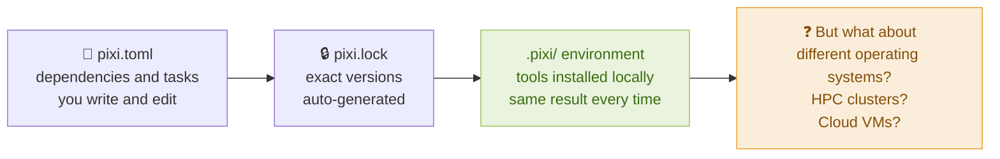

**Pixi's limitation:** It installs tools compiled for your current operating system. If your laptop runs macOS and the cluster runs CentOS 7, your Pixi environment will not transfer. **Docker solves this** by packaging the tool and its entire OS-level runtime into one portable container.

---

## Session 2 · What is Docker? Containers vs Virtual Machines (09:10 – 09:40)

### The Shipping Container Analogy

Before standardized shipping containers, loading cargo onto ships was chaotic — every item had a different shape and handling requirement. The standardized container changed everything: one box that fits any ship, truck, or crane without repacking.

Docker does the same for software. A containerized application runs identically on any machine that has Docker installed — your laptop, a server, AWS, or a collaborator's machine.

### Virtual Machines vs Docker Containers

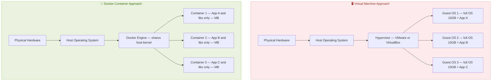

| Aspect | Virtual Machine | Docker Container |
|---|---|---|
| Size | 5–20 GB per VM | 50 MB – 2 GB per image |
| Startup time | Minutes | Seconds |
| OS overhead | Full OS per instance | Shares host kernel |
| Isolation | Complete | Process-level |
| Portability | Heavy VM image | Lightweight Docker image |
| Use in bioinformatics | Rare | Very common — nf-core, cloud HPC |

### Docker Architecture

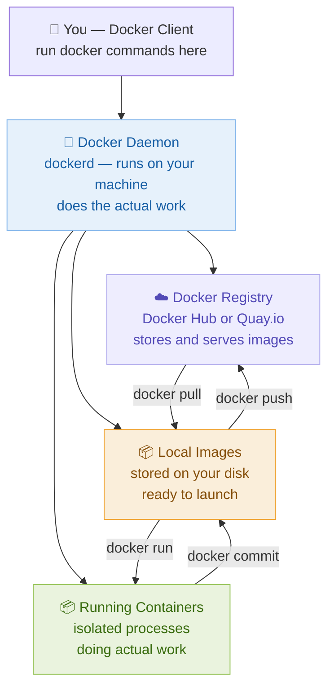

### Four Core Docker Concepts

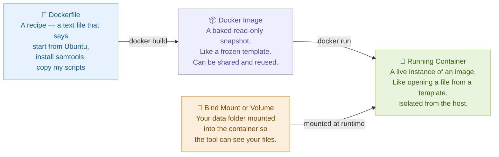

> Think of the **Dockerfile** as a recipe, the **Image** as a sealed jar of food made from that recipe, and the **Container** as opening the jar and actually eating from it. The **Volume** is the cutting board — it is your actual data, brought into the container at mealtime.

---

## Session 3 · Installing Docker Desktop (09:40 – 10:00)

### Installation by Platform

**Linux (Ubuntu / Debian):**

```bash
# Remove any old Docker versions first
sudo apt-get remove docker docker-engine docker.io containerd runc

# Install prerequisites
sudo apt-get update
sudo apt-get install -y ca-certificates curl gnupg

# Add Docker's official GPG key and repository
curl -fsSL https://download.docker.com/linux/ubuntu/gpg | \
  sudo gpg --dearmor -o /usr/share/keyrings/docker-archive-keyring.gpg

echo "deb [arch=$(dpkg --print-architecture) signed-by=/usr/share/keyrings/docker-archive-keyring.gpg] \
  https://download.docker.com/linux/ubuntu $(lsb_release -cs) stable" | \
  sudo tee /etc/apt/sources.list.d/docker.list > /dev/null

sudo apt-get update
sudo apt-get install -y docker-ce docker-ce-cli containerd.io

# Allow running Docker without sudo (log out and back in after this)
sudo usermod -aG docker $USER
```

> `usermod -aG docker $USER` adds your user to the `docker` group so you do not need `sudo` for every command. You must log out and log back in for this to take effect.

**macOS and Windows:** Download Docker Desktop from https://www.docker.com/products/docker-desktop and run the installer. On Windows with WSL2, Docker Desktop automatically integrates with your Ubuntu terminal.

### Verify the Installation

```bash
docker --version
# Docker version 24.x.x

docker run hello-world
```

### What Happens When You Run hello-world

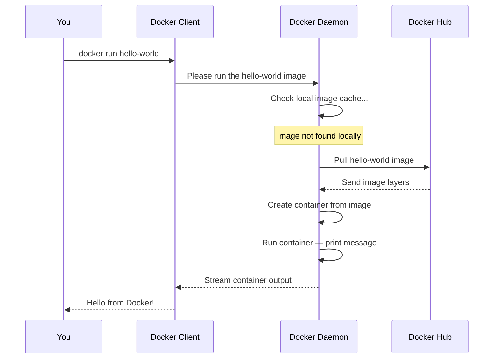

---

## ☕ Break (10:00 – 10:10)

---

## Session 4 · Docker Core Concepts Deep Dive (10:10 – 10:50)

### Image Layers: How Docker Images Are Built

Docker images are made of **layers**. Each instruction in a Dockerfile adds one layer on top of the previous one. Layers are cached and shared — if two images both start from `ubuntu:22.04`, they share that layer on disk.

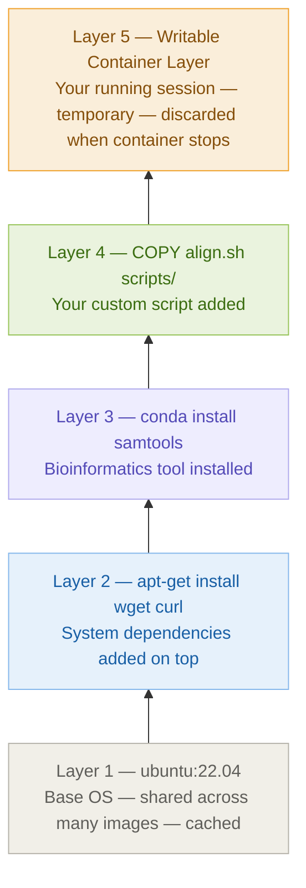

**Why layers matter for bioinformatics:**

- The Ubuntu base layer is cached locally and never re-downloaded
- If you change only your script (Layer 4), only that layer rebuilds — saves enormous time
- Layers are shared between images — if five images all use Ubuntu 22.04, that layer exists only once on disk

### Volumes: Getting Your Data Into a Container

By default, containers are completely isolated — they cannot see files on your machine. You must explicitly mount your data using a **bind mount**.

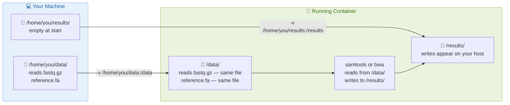

> The `-v` flag creates a bridge: `/home/you/data` on your machine appears as `/data` inside the container. Files written to `/results/` inside the container appear immediately in `/home/you/results/` on your machine.

### Essential Docker Commands

```bash
# Images
docker images                              # List all local images
docker pull ubuntu:22.04                   # Download an image
docker pull quay.io/biocontainers/samtools # Pull a bio image
docker rmi ubuntu:22.04                    # Remove a local image

# Running containers
docker run ubuntu:22.04 echo "Hello"       # Run one command and exit
docker run -it ubuntu:22.04 bash           # Open interactive terminal
docker run --rm ubuntu:22.04 echo "Hi"     # Auto-remove when done

# With volume mounts
docker run --rm \
  -v /home/you/data:/data \
  -v /home/you/results:/results \
  quay.io/biocontainers/samtools:1.17--h00cdaf9_0 \
  samtools view -c /data/sample.bam

# Container management
docker ps                                  # List running containers
docker ps -a                               # List all containers including stopped
docker stop container_id                   # Stop a running container
docker rm container_id                     # Remove a stopped container

# Build and share
docker build -t myimage:v1 .              # Build from Dockerfile in current dir
docker login                              # Login to Docker Hub
docker push username/myimage:v1           # Share your image
```

---

## Session 5 · Lab: Writing a Dockerfile for NGS (10:50 – 11:20)

### Lab Goal

Write a Dockerfile that creates an image containing `bwa` and `samtools` plus a custom alignment script. Build it, test it, and run it with mounted data.

### Understanding Dockerfile Instructions

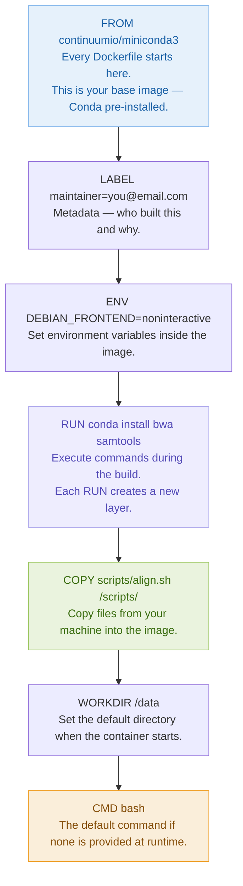

### Step 1: Set Up the Project Directory

```bash
mkdir ngs-docker && cd ngs-docker
mkdir scripts
```

### Step 2: Write the Dockerfile

Create a file called `Dockerfile` (no file extension):

```bash
nano Dockerfile
```

Paste the following content:

```dockerfile
# Start from Miniconda3 — gives us conda already installed
FROM continuumio/miniconda3:24.1.2-0

# Metadata labels — describe your image
LABEL maintainer="your@email.com"
LABEL description="NGS alignment image with bwa and samtools"
LABEL version="1.0"

# Configure channels — must include bioconda for NGS tools
RUN conda config --add channels defaults && \
    conda config --add channels bioconda && \
    conda config --add channels conda-forge && \
    conda config --set channel_priority strict

# Install NGS tools in one RUN command to minimize layers
# --yes skips all confirmation prompts during build
# conda clean removes the cache to reduce final image size
RUN conda install --yes \
    bwa=0.7.17 \
    samtools=1.17 \
    && conda clean --all --yes

# Copy our alignment wrapper script into the image
COPY scripts/align.sh /scripts/align.sh
RUN chmod +x /scripts/align.sh

# Set /data as the working directory
# This is where you land when you enter the container
WORKDIR /data

# Default command — open bash if nothing else is specified
CMD ["/bin/bash"]
```

> Chaining RUN commands with `&&` is a best practice. Each `RUN` creates a layer. Combining the `conda install` and `conda clean` into one `RUN` means the cache is cleaned *in the same layer* — this prevents the cache from being baked into an intermediate layer and bloating your image.

### Step 3: Write the Alignment Script

```bash
cat > scripts/align.sh << 'EOF'
#!/bin/bash
# Simple BWA-MEM alignment script
# Usage: align.sh <reference.fa> <R1.fastq.gz> <R2.fastq.gz> <output.bam>

set -euo pipefail

REF=$1
R1=$2
R2=$3
OUT=$4

echo "=== Step 1: Indexing reference ==="
bwa index $REF

echo "=== Step 2: Aligning reads with BWA-MEM ==="
bwa mem -t 4 $REF $R1 $R2 | samtools sort -o $OUT

echo "=== Step 3: Indexing BAM file ==="
samtools index $OUT

echo "=== Step 4: Alignment statistics ==="
samtools flagstat $OUT
EOF
```

> `set -euo pipefail` is a safety setting: `-e` stops the script on any error, `-u` catches undefined variables, `-o pipefail` catches errors inside pipes. Always use this in production scripts.

### Step 4: Build the Image

```bash
docker build -t ngs-aligner:v1 .
```

> The `-t` flag tags the image with a name and version. The `.` tells Docker to look for the `Dockerfile` in the current directory. Watch each step print as it executes — each one corresponds to a Dockerfile instruction.

Expected final output:

```
Successfully built a1b2c3d4e5f6
Successfully tagged ngs-aligner:v1
```

### Step 5: Test the Image

```bash
# Confirm the image exists locally
docker images | grep ngs-aligner

# Test that tools are installed correctly
docker run --rm ngs-aligner:v1 samtools --version
docker run --rm ngs-aligner:v1 bwa 2>&1 | head -5
```

> `--rm` automatically removes the container after it exits. For one-off commands, always use `--rm` to avoid accumulating stopped containers.

### Step 6: Run with Mounted Data

```bash
docker run --rm \
  -v $(pwd)/data:/data \
  -v $(pwd)/results:/results \
  ngs-aligner:v1 \
  /scripts/align.sh \
    /data/reference.fa \
    /data/reads_R1.fastq.gz \
    /data/reads_R2.fastq.gz \
    /results/aligned.bam
```

> `$(pwd)` expands to your current directory path. This makes the `-v` paths absolute, which Docker requires.

### The Complete Build and Run Lifecycle

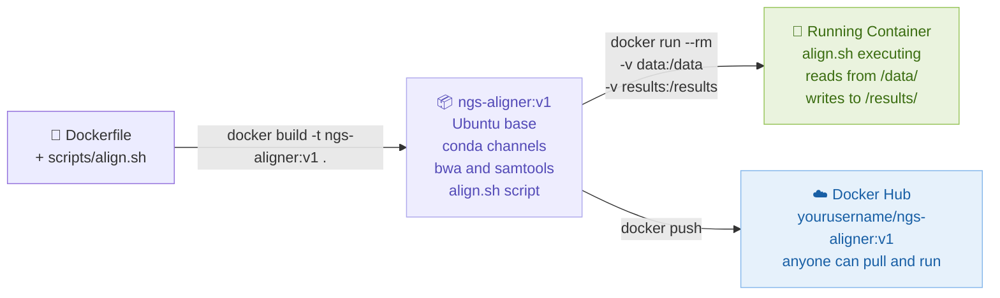

---

## Session 6 · Lab: Running Pre-built BioContainers (11:20 – 11:45)

### Lab Goal

Use pre-built biocontainers — no Dockerfile required. Pull and run real tools from the BioContainers registry.

### The BioContainers Ecosystem

Every tool in BioConda automatically gets a Docker image built and published to Quay.io. This means you can run almost any bioinformatics tool without writing a single Dockerfile.

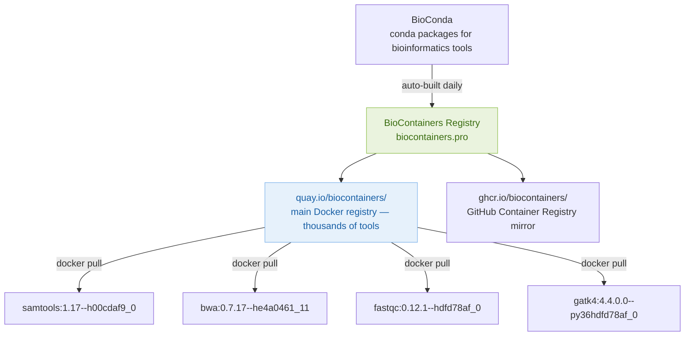

> The version string after `--` (like `h00cdaf9_0`) is a build hash. Always pin an exact version when writing pipelines — never use `latest` in production because it changes without warning.

### Finding the Right BioContainer

```bash
# Pull samtools directly — no Dockerfile needed
docker pull quay.io/biocontainers/samtools:1.17--h00cdaf9_0

# Run it with your data
docker run --rm \
  -v $(pwd)/data:/data \
  quay.io/biocontainers/samtools:1.17--h00cdaf9_0 \
  samtools flagstat /data/aligned.bam
```

### Running GATK Without Installing It

```bash
# Pull GATK — 10+ GB of dependencies, zero manual install
docker pull broadinstitute/gatk:4.4.0.0

# Run HaplotypeCaller
docker run --rm \
  -v $(pwd)/data:/data \
  -v $(pwd)/results:/results \
  broadinstitute/gatk:4.4.0.0 \
  gatk HaplotypeCaller \
    -R /data/reference.fa \
    -I /data/aligned.bam \
    -O /results/variants.vcf.gz
```

> This is one of Docker's greatest strengths for bioinformatics. GATK alone requires Java, specific Python versions, and dozens of dependencies. With Docker, you just pull and run.

### A Complete NGS Workflow Using Only Containers

```mermaid
flowchart LR
    Raw["📄 Raw FASTQ reads"]
    QC["🐳 fastqc container<br/>quality check"]
    Trim["🐳 trimmomatic container<br/>adapter trimming"]
    Align["🐳 bwa container<br/>read alignment"]
    Sort["🐳 samtools container<br/>BAM sorting and indexing"]
    Variant["🐳 gatk container<br/>variant calling"]
    Report["📊 VCF file<br/>+ MultiQC report"]

    Raw --> QC --> Trim --> Align --> Sort --> Variant --> Report

    style Raw fill:#F1EFE8,color:#5F5E5A,stroke:#B4B2A9
    style Report fill:#EAF3DE,color:#3B6D11,stroke:#97C459
```

### Pushing Your Image to Docker Hub

```bash
# Create a free account at hub.docker.com first, then:
docker login

# Tag your image with your Docker Hub username
docker tag ngs-aligner:v1 yourusername/ngs-aligner:v1

# Push to Docker Hub — now the world can use it
docker push yourusername/ngs-aligner:v1

# Anyone anywhere can now run:
docker run --rm yourusername/ngs-aligner:v1 samtools --version
```

---

## Session 7 · Q&A and Day 2 Recap (11:45 – 12:00)

### What We Covered Today

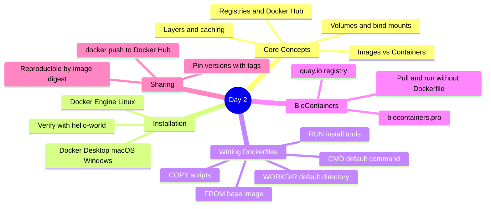

### Day 2 Quick Reference

| Task | Command |
|---|---|
| Pull an image | `docker pull image:tag` |
| Run a one-off command | `docker run --rm image:tag command` |
| Open interactive shell | `docker run -it --rm image:tag bash` |
| Mount data directory | `-v /host/path:/container/path` |
| Build an image | `docker build -t myimage:v1 .` |
| List local images | `docker images` |
| List running containers | `docker ps` |
| List all containers | `docker ps -a` |
| Push to Docker Hub | `docker push username/image:tag` |
| Remove an image | `docker rmi image:tag` |

### The Pixi + Docker Relationship

| Tool | Layer | What it manages |
|---|---|---|
| Pixi | Host environment | Your dev tools, scripts, task runner |
| Docker | Container environment | Reproducible analysis tools for any platform |

Tomorrow we add **Nextflow** — the orchestration layer that chains Docker containers into scalable, resumable, automated pipelines. See you then! 🔁
