# Day 3: Getting Started with Nextflow nf-core
### Workflow Management for Everyone · 09:00 – 12:00

---

## 🎯 Day 3 Learning Objectives

By the end of today, you will be able to:

- Explain what workflow management is and why bioinformatics needs it
- Install Nextflow and the nf-core CLI tools via Pixi
- Browse and select the right nf-core pipeline for your data
- Run an nf-core pipeline end-to-end using test data
- Read pipeline outputs and MultiQC reports
- Understand exactly how Pixi, Docker, and Nextflow work together as a stack

---

## Session 1 · Recap and Warm-up (09:00 – 09:10)

### The Story So Far

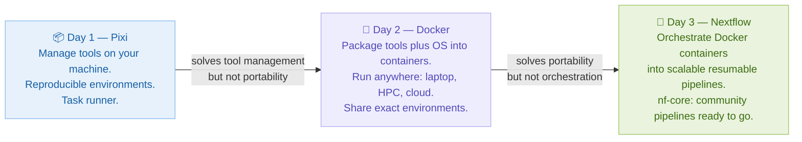

---

## Session 2 · What is Workflow Management? (09:10 – 09:40)

### The Problem: The Shell Script Trap

Almost every bioinformatics lab starts with shell scripts. They work — until they don't.

```bash
#!/bin/bash
# A "pipeline" that causes real headaches at scale

fastqc sample1.fastq.gz sample2.fastq.gz -o qc/

trimmomatic PE sample1.fastq.gz sample2.fastq.gz \
  sample1_trimmed.fastq.gz sample1_unpaired.fastq.gz \
  sample2_trimmed.fastq.gz sample2_unpaired.fastq.gz \
  ILLUMINACLIP:adapters.fa:2:30:10

bwa mem reference.fa sample1_trimmed.fastq.gz sample2_trimmed.fastq.gz | \
  samtools sort -o sample.bam
```

**What goes wrong when:**

- The job fails at step 3 after 6 hours? → You restart everything from scratch
- You have 200 samples instead of 2? → Each sample runs one at a time, sequentially
- A collaborator needs to replicate? → Hope they have identical software versions
- You want to run on HPC? → Rewrite all the job submission scripts
- Step 2 finishes for Sample A before step 1 finishes for Sample B? → No parallelism possible

### The Workflow Manager Solution

```mermaid
flowchart TD
    subgraph Problem["❌ Without a Workflow Manager"]
        S1["Step 1 runs"] --> S2["Step 2 runs"]
        S2 --> S3["Step 3 runs — FAILS after 4 hours"]
        S3 --> S4["Restart everything from Step 1"]
    end

    subgraph Solution["✅ With Nextflow"]
        N1["QC — all samples in parallel"] --> N2["TRIM — all samples in parallel"]
        N2 --> N3["ALIGN — all samples in parallel"]
        N3 -->|"Sample 5 fails"| Resume["-resume flag"]
        Resume -->|"Only reruns Sample 5"| N4["ALIGN — Sample 5 only"]
        N4 --> N5["Pipeline complete"]
    end

    style Problem fill:#FCEBEB,color:#A32D2D,stroke:#F09595
    style Solution fill:#EAF3DE,color:#3B6D11,stroke:#97C459
```

### What is Nextflow?

Nextflow is a **workflow orchestration language** designed for scientific pipelines. It uses a **dataflow programming model** — you describe what to do with your data, and Nextflow figures out the order, parallelism, and resource allocation automatically.

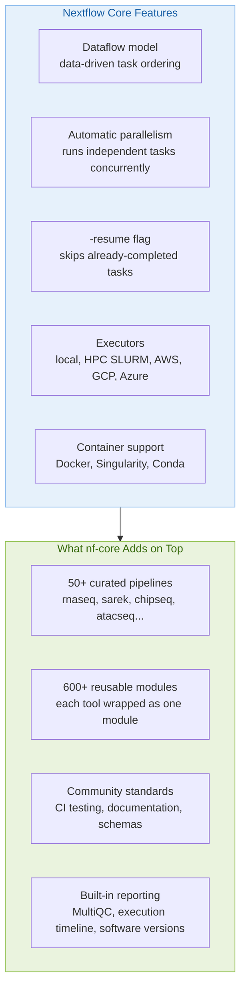

### The Two Building Blocks: Channels and Processes

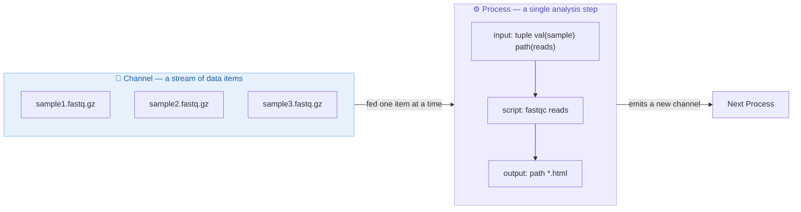

> Think of a **Channel** as a conveyor belt carrying your samples. Each sample goes into a **Process** independently. Nextflow runs as many samples at the same time as your machine can handle — no manual parallelism needed.

### Automatic Parallelism Across Samples

```mermaid
gantt
    title Nextflow processes 4 samples in parallel automatically
    dateFormat s
    axisFormat t=%S

    section Sample 1
    QC           : a1, 0, 10s
    Trim         : a2, after a1, 15s
    Align        : a3, after a2, 20s

    section Sample 2
    QC           : b1, 0, 12s
    Trim         : b2, after b1, 14s
    Align        : b3, after b2, 22s

    section Sample 3
    QC           : c1, 0, 9s
    Trim         : c2, after c1, 16s
    Align        : c3, after c2, 18s

    section Sample 4
    QC           : d1, 0, 11s
    Trim         : d2, after d1, 13s
    Align        : d3, after d2, 21s
```

---

## Session 3 · Installing Nextflow and nf-core Tools (09:40 – 10:00)

### Option A: Install via Pixi (Recommended)

This is the cleanest approach — it uses exactly what you learned on Day 1:

```bash
# Go into your workshop project from Day 1
cd ngs-workshop

# Add Nextflow and the nf-core Python CLI
pixi add nextflow nf-core

# Verify both tools are available
pixi run nextflow -version
pixi run nf-core --version
```

> Using Pixi to manage Nextflow means your Nextflow version is locked in `pixi.lock` just like any other tool. Everyone on your team uses the same Nextflow version automatically.

### Option B: Manual Installation

```bash
# Nextflow requires Java 11 or newer
java -version

# If Java is missing, install it
sudo apt install -y default-jdk

# Download and install Nextflow
curl -s https://get.nextflow.io | bash
chmod +x nextflow
sudo mv nextflow /usr/local/bin/

# Install the nf-core Python tools
pip install nf-core

# Verify
nextflow -version
nf-core --version
```

### Installation Decision Flow

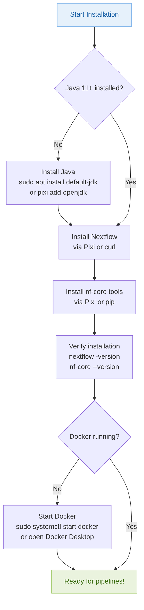

---

## ☕ Break (10:00 – 10:10)

---

## Session 4 · Browsing nf-core Pipelines (10:10 – 10:30)

### The nf-core Pipeline Ecosystem

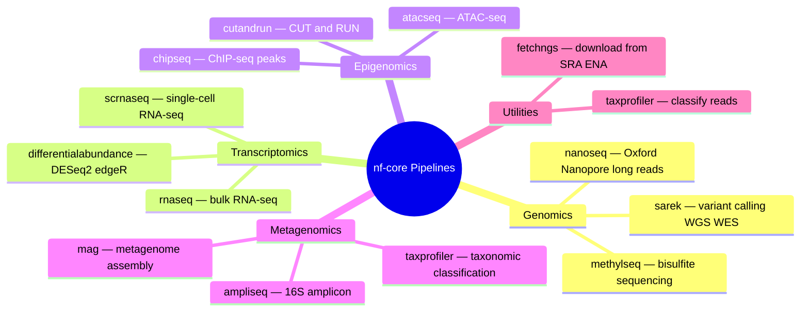

### Finding the Right Pipeline

```bash
# List all available pipelines with descriptions
nf-core list

# Search for RNA-seq related pipelines
nf-core list --keyword rna

# Get detailed help for a specific pipeline
nextflow run nf-core/rnaseq --help
```

### Browsing Parameters Interactively

```bash
# Launch the interactive parameter builder
nf-core launch rnaseq
```

> `nf-core launch` opens a guided form in your terminal that walks you through every parameter. It shows descriptions, valid values, and required vs optional fields — much easier than reading through all the docs when you are just getting started.

### The Samplesheet: How You Tell the Pipeline About Your Data

Every nf-core pipeline takes a **samplesheet** — a simple CSV file — instead of individual file paths. This standardizes how all pipelines receive input.

```csv
sample,fastq_1,fastq_2,strandedness
SAMPLE_A,/data/sampleA_R1.fastq.gz,/data/sampleA_R2.fastq.gz,auto
SAMPLE_B,/data/sampleB_R1.fastq.gz,/data/sampleB_R2.fastq.gz,auto
SAMPLE_C,/data/sampleC_R1.fastq.gz,,auto
```

> Leave `fastq_2` blank for single-end samples. The `strandedness` column accepts `auto`, `forward`, `reverse`, or `unstranded`. Using `auto` lets the pipeline detect it from the data — the safe default for beginners.

| Column | Description |
|---|---|
| `sample` | Your sample name — used in all output filenames |
| `fastq_1` | Path to R1 (forward reads) |
| `fastq_2` | Path to R2 (reverse reads) — blank for single-end |
| `strandedness` | Library strandedness — use `auto` if unsure |

---

## Session 5 · Lab: Run Your First nf-core Pipeline (10:30 – 11:10)

### Lab Goal

Run `nf-core/fetchngs` to download a public dataset, then run `nf-core/rnaseq` with the built-in test profile. Docker containers are pulled automatically — no manual tool installation needed.

### Part A: Download Public Data with nf-core/fetchngs

`fetchngs` downloads sequencing data from SRA or ENA given a list of accession IDs. It saves you from manually navigating data repositories.

**Step 1: Create an accession list**

```bash
mkdir fetchngs-demo && cd fetchngs-demo

cat > ids.csv << 'EOF'
SRR493366
SRR493367
EOF
```

> `SRR` IDs are Sequence Read Archive accession numbers. `fetchngs` looks these up, finds the download URLs, and downloads both the FASTQ files and associated metadata automatically.

**Step 2: Run the pipeline**

```bash
nextflow run nf-core/fetchngs \
  -revision 1.12.0 \
  -profile docker \
  --input ids.csv \
  --outdir results/fetchngs
```

> `-revision 1.12.0` pins an exact version of the pipeline — always do this in real analyses so your results are reproducible. `-profile docker` tells Nextflow to run each process inside its Docker container.

**Step 3: Watch it run**

```
N E X T F L O W  ~  version 23.10.0
Launching nf-core/fetchngs [magical_einstein] - revision: 1.12.0

executor >  local (8)
[32/9a4c11] SRA_IDS_TO_RUNINFO (SRR493366)  [100%] 2 of 2 ✔
[17/b2c3d4] SRA_RUNINFO_TO_FTP (SRR493366)  [100%] 2 of 2 ✔
[ab/c12345] FASTQ_DOWNLOAD (SRR493366)       [100%] 2 of 2 ✔

Completed at: 2024-01-15 10:15:23
Duration    : 4m 32s
```

### Part B: Run nf-core/rnaseq with Test Data

The `test` profile uses tiny datasets built into the pipeline — perfect for learning and validating your setup without waiting for real data to download.

```bash
cd ..
mkdir rnaseq-demo && cd rnaseq-demo

nextflow run nf-core/rnaseq \
  -revision 3.14.0 \
  -profile test,docker \
  --outdir results/rnaseq
```

> `test,docker` combines two profiles: `test` provides tiny built-in datasets, and `docker` uses containers for every step. Combining profiles with commas is standard nf-core syntax.

### Understanding the Pipeline DAG

As the pipeline runs, Nextflow executes these steps in the correct order:

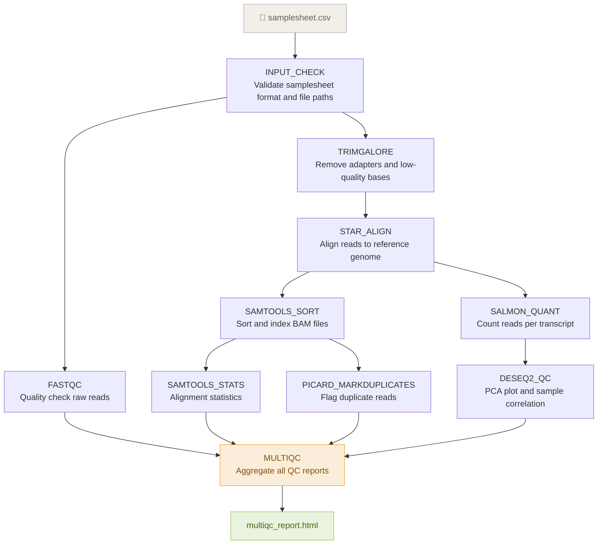

### The -resume Flag: Your Best Friend After a Failure

```bash
# If your run fails partway through, do not start over:
nextflow run nf-core/rnaseq \
  -revision 3.14.0 \
  -profile test,docker \
  --outdir results/rnaseq \
  -resume
```

**How -resume works:**

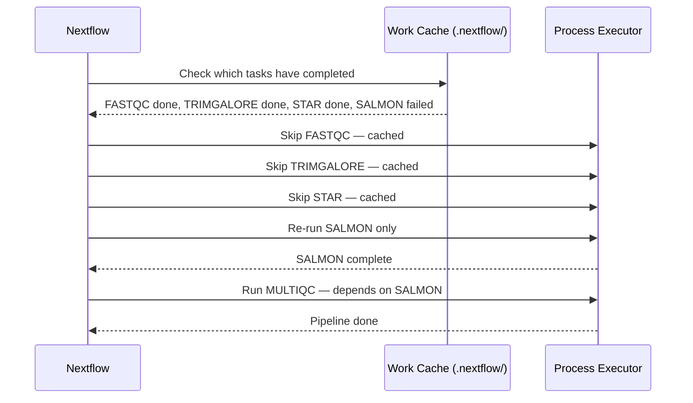

> Nextflow keeps a `.nextflow/` cache directory. Each completed task has a unique hash based on its inputs. If the inputs have not changed, the task is skipped entirely. This makes `-resume` incredibly powerful for long-running pipelines.

---

## Session 6 · Understanding Outputs and Reports (11:10 – 11:30)

### The Output Directory Structure

```
results/rnaseq/
├── fastqc/
│   ├── sample1_R1_fastqc.html
│   └── sample1_R2_fastqc.html
├── trimgalore/
│   └── sample1/
│       ├── sample1_R1_trimmed.fq.gz
│       └── sample1_trimming_report.txt
├── star_salmon/
│   ├── sample1/
│   │   ├── sample1.Aligned.sortedByCoord.out.bam
│   │   └── quant.sf
│   └── salmon.merged.gene_counts.tsv  <- use this for DESeq2
├── deseq2_qc/
│   ├── pca.pdf
│   └── heatmap.pdf
├── multiqc/
│   ├── multiqc_report.html            <- open this first
│   └── multiqc_data/
└── pipeline_info/
    ├── execution_report.html
    ├── execution_timeline.html
    └── software_versions.yml          <- copy versions into your methods section
```

> `salmon.merged.gene_counts.tsv` is a matrix of genes x samples — the main input to downstream differential expression tools like DESeq2 or edgeR.

### Reading the MultiQC Report

The `multiqc_report.html` aggregates all QC metrics into one page. Here is how to interpret the key sections:

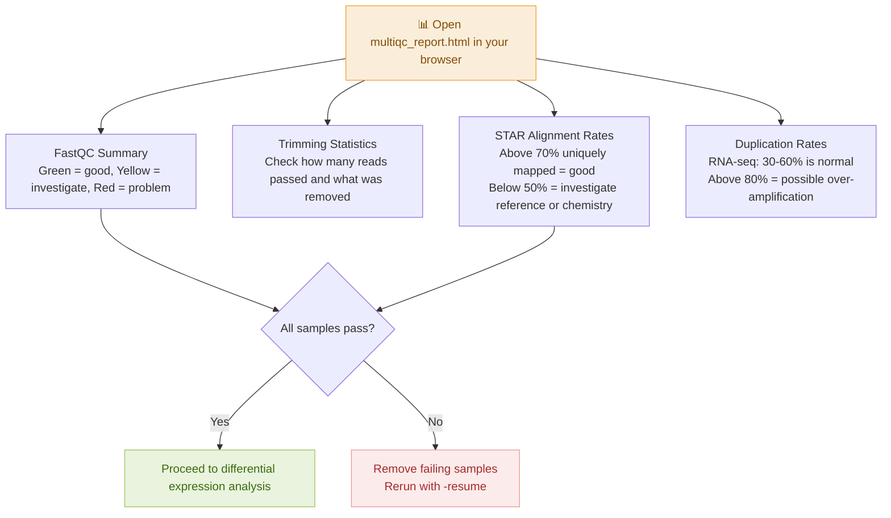

### The Software Versions File: Copy-Paste Your Methods Section

`pipeline_info/software_versions.yml` records the exact version of every tool used:

```yaml
FASTQC:
  FastQC: 0.12.1
TRIMGALORE:
  Trim Galore!: 0.6.7
STAR:
  STAR: 2.7.10b
SALMON:
  Salmon: 1.10.1
SAMTOOLS:
  SAMtools: 1.17
```

> When writing your paper's methods section, copy these versions directly. This is one of the most valuable features nf-core provides — automatic provenance tracking for every tool in your pipeline.

---

## Session 7 · Connecting the Trilogy: Pixi + Docker + Nextflow (11:30 – 11:45)

### The Complete Modern Bioinformatics Stack

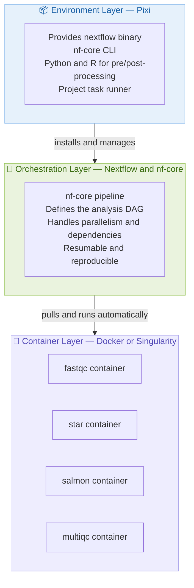

> Each layer has a clear responsibility. Pixi manages your development environment. Docker makes each analysis step portable. Nextflow wires everything together into a pipeline that runs correctly on your laptop, an HPC, or the cloud — without changing a single line.

### A Real Project Using All Three Tools

Here is a `pixi.toml` that orchestrates the entire analysis lifecycle:

```toml
[project]
name = "rnaseq-project-2024"
version = "1.0.0"
channels = ["conda-forge", "bioconda"]
platforms = ["linux-64", "osx-arm64"]

[dependencies]
nextflow = ">=23.10"
nf-core = ">=2.11"
python = ">=3.11"
r-base = ">=4.3"
bioconductor-deseq2 = ">=1.42"

[tasks]
# Download raw data from SRA
download = "nextflow run nf-core/fetchngs -revision 1.12.0 -profile docker --input config/ids.csv --outdir data/raw"

# Run the RNA-seq pipeline
rnaseq = "nextflow run nf-core/rnaseq -revision 3.14.0 -profile docker -params-file config/rnaseq_params.yml --outdir results"

# Resume after a failure
resume = "nextflow run nf-core/rnaseq -revision 3.14.0 -profile docker -params-file config/rnaseq_params.yml --outdir results -resume"

# Run downstream DESeq2 analysis
deseq2 = "Rscript scripts/deseq2_analysis.R"

# Run the complete analysis end-to-end
all = { depends-on = ["download", "rnaseq", "deseq2"] }
```

**Reproduce the entire analysis in one command:**

```bash
pixi run all
```

### Choosing the Right Tool for Each Situation

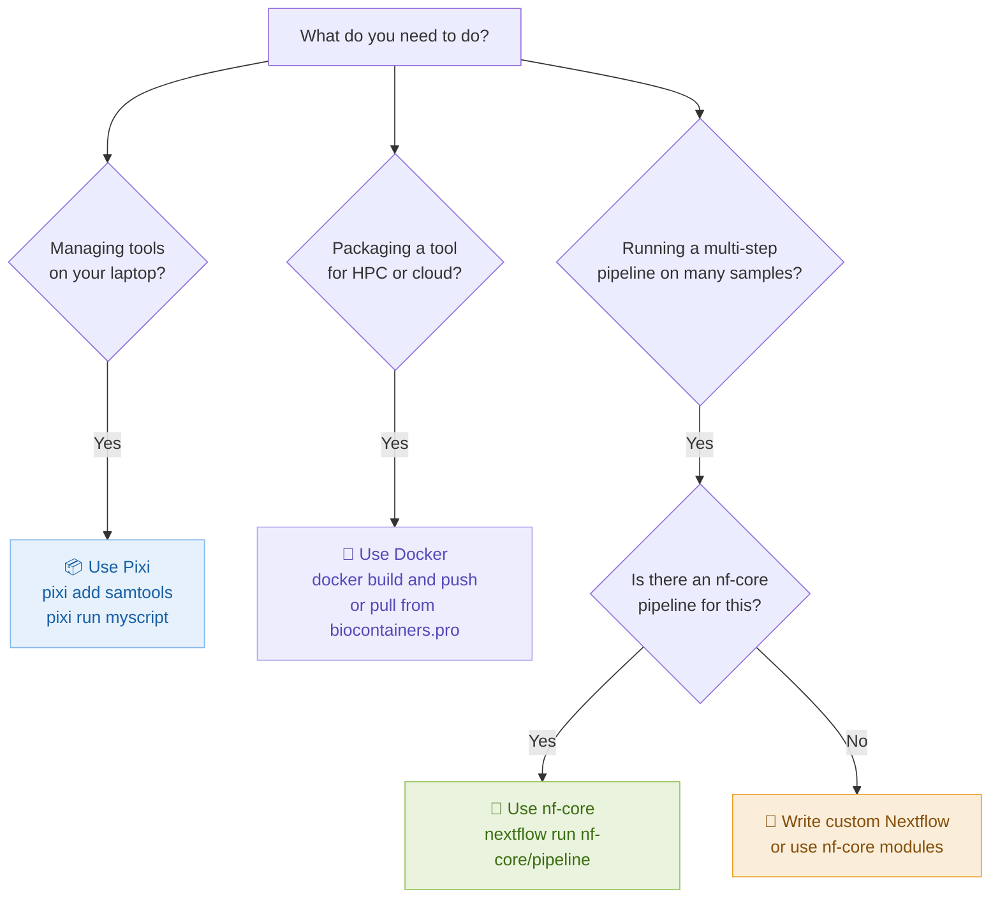

---

## Session 8 · Q&A, Resources and Next Steps (11:45 – 12:00)

### What We Covered Today

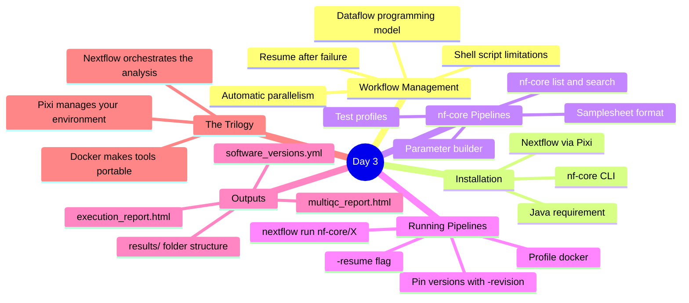

### Complete 3-Day Quick Reference

| Tool | Task | Command |
|---|---|---|
| **Pixi** | Create a project | `pixi init myproject` |
| **Pixi** | Add a package | `pixi add fastqc` |
| **Pixi** | Run a task | `pixi run qc` |
| **Pixi** | Share the environment | Commit `pixi.lock` to git |
| **Docker** | Pull a bio tool | `docker pull quay.io/biocontainers/samtools:1.17--h00cdaf9_0` |
| **Docker** | Run with data | `docker run --rm -v $(pwd)/data:/data image command` |
| **Docker** | Build custom image | `docker build -t myimage:v1 .` |
| **Nextflow** | Run a pipeline | `nextflow run nf-core/rnaseq -revision 3.14.0 -profile docker` |
| **Nextflow** | Resume after failure | `nextflow run ... -resume` |
| **nf-core** | List pipelines | `nf-core list` |
| **nf-core** | Get parameter help | `nextflow run nf-core/X --help` |

### Your Learning Path from Here

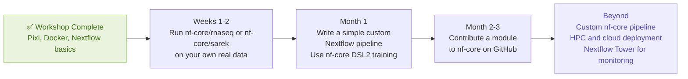

### Community Resources

| Resource | Link | What it is for |
|---|---|---|
| nf-core website | https://nf-co.re | Pipeline documentation and tutorials |
| nf-core Slack | https://nf-co.re/join | Ask questions — very welcoming community |
| Nextflow documentation | https://nextflow.io/docs | Full language reference |
| Nextflow Tower | https://tower.nf | Monitor and manage pipeline runs |
| BioContainers | https://biocontainers.pro | Browse Docker images for bio tools |
| Pixi documentation | https://pixi.sh | Pixi command reference |
| Seqera blog | https://seqera.io/blog | Best practices and real-world examples |

---

## 🎉 Congratulations — You Did It!

You have completed the Bioinformatics Workflow Bootcamp. You now understand three of the most important tools in modern computational biology — and more importantly, you understand **how they fit together**.

**Pixi** sets up your environment cleanly, reproducibly, and without the pain of Conda dependency conflicts.

**Docker** packages your tools into containers that run identically anywhere — your laptop, an HPC cluster, or the cloud.

**Nextflow + nf-core** orchestrates those containers into scalable, resumable, community-tested pipelines.

Every expert started exactly where you are today. The best next step is to try running these tools on your own real data. When you get stuck, the nf-core Slack community is one of the most welcoming places in all of bioinformatics.

Good luck with your analyses!
